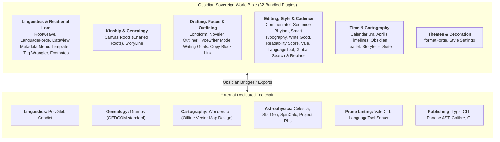

# Master Reference: External Tools & Obsidian Plugins (`docs/guides/EXTERNAL_TOOLS_AND_PLUGINS.md`)
> **Ars Arcanum Sovereign Authoring Ecosystem — Tool-First Architecture** | GPA 4.0 / Grade A+

---

## 1. Architectural Philosophy: Tool-First Architecture

Ars Arcanum enforces a strict **Tool-First Directive**: whenever an authoring, worldbuilding, editing, styling, or compiling capability is provided by an open-source, offline, privacy-first external tool or Obsidian community plugin, the system leverages that tool directly rather than maintaining bespoke custom code.



---

## 2. Comprehensive Obsidian Plugin Directory (32 Plugins)

All 32 plugins are pre-configured in [`templates/world-bible/.obsidian/plugins/`](file:///templates/world-bible/.obsidian/plugins/) and tracked with pinned SHA-256 digests in [`templates/world-bible/.obsidian/plugins/manifest.json`](file:///templates/world-bible/.obsidian/plugins/manifest.json).

### 2.1 Linguistics, Conlangs & Relational Lore

#### 1. Rootweave (Conlang Morpheme & Dictionary Studio)
* **Identifier**: `rootweave` | **Version**: `0.2.2`
* **Upstream**: [GitHub: molive6316github/rootweave](https://github.com/molive6316github/rootweave)
* **Purpose**: In-vault root morpheme manager, word builder, morphological validation, lexicon compiler, and interlinear glossing in notes.
* **Workflow**: Define roots and affixes in root dossiers. Assemble compound words with real-time phonotactic checking. Render interlinear glosses in draft dialogue.
* **Learning Resources**: [Rootweave Repository](https://github.com/molive6316github/rootweave#readme).

#### 2. LanguageForge (Phonology & Naming Culture Studio)
* **Identifier**: `languageforge` | **Version**: `1.1.0`
* **Upstream**: [GitHub: KennyRN/languageForge](https://github.com/KennyRN/languageForge)
* **Purpose**: Generates naming cultures, phonology rules, vocabulary batches, and visual language family trees.
* **Workflow**: Configure phonetic inventories (consonants, vowels, syllable structures) to generate culturally cohesive character, settlement, and artifact names.
* **Learning Resources**: [LanguageForge Guide](https://github.com/KennyRN/languageForge#readme).

#### 3. Dataview (Relational Markdown Database)
* **Identifier**: `dataview` | **Version**: `0.5.68`
* **Upstream**: [GitHub: blacksmithgu/obsidian-dataview](https://github.com/blacksmithgu/obsidian-dataview)
* **Purpose**: Relational database engine for Markdown vaults using Dataview Query Language (DQL).
* **Sample DQL Query**:
  ```sql
  ```dataview
  TABLE status AS "Status", role AS "Role", faction AS "Faction"
  FROM "World/Characters"
  WHERE status != "Deceased"
  SORT file.name ASC
  ```
  ```
* **Learning Resources**: [Official Dataview Documentation](https://blacksmithgu.github.io/obsidian-dataview/).

#### 4. Metadata Menu (Typed Frontmatter Schemas)
* **Identifier**: `metadata-menu` | **Version**: `0.8.12`
* **Upstream**: [GitHub: mdelobelle/obsidian-metadata-menu](https://github.com/mdelobelle/obsidian-metadata-menu)
* **Purpose**: Strict `fileClass` schema enforcement, typed field dropdowns, and YAML autocomplete for characters, factions, artifacts, and locations.
* **Learning Resources**: [Metadata Menu Documentation](https://mdelobelle.github.io/metadatamenu/).

#### 5. Tag Wrangler (Taxonomy & Tag Merging)
* **Identifier**: `tag-wrangler` | **Version**: `0.6.5`
* **Upstream**: [GitHub: pjeby/tag-wrangler](https://github.com/pjeby/tag-wrangler)
* **Purpose**: Right-click tag renaming, hierarchy merging, and tag-page hubs directly from the Obsidian tag pane.
* **Learning Resources**: [Tag Wrangler Documentation](https://github.com/pjeby/tag-wrangler).

#### 6. Footnote Shortcut (Inline Citation Scaffolding)
* **Identifier**: `obsidian-footnotes` | **Version**: `0.2.0`
* **Upstream**: [GitHub: MichaBrugger/obsidian-footnotes](https://github.com/MichaBrugger/obsidian-footnotes)
* **Purpose**: Hotkey citation scaffolding (`[^1]`) with in-place modal editing and auto-indexing.
* **Learning Resources**: [Footnote Shortcut Repository](https://github.com/MichaBrugger/obsidian-footnotes).

#### 7. Copy Block Link (Deep Linking)
* **Identifier**: `obsidian-copy-block-link` | **Version**: `1.0.4`
* **Upstream**: [GitHub: mgmeyers/obsidian-copy-block-link](https://github.com/mgmeyers/obsidian-copy-block-link)
* **Purpose**: 1-click context menu copying of deep block links (`[[Note#^block-id]]`).
* **Learning Resources**: [Copy Block Link Repository](https://github.com/mgmeyers/obsidian-copy-block-link).

#### 8. Templater (Dynamic Automation & Scaffolding)
* **Identifier**: `templater-obsidian` | **Version**: `2.25.1`
* **Upstream**: [GitHub: SilentVoid13/Templater](https://github.com/SilentVoid13/Templater)
* **Purpose**: Dynamic note generation, date math, UUID injection, and frontmatter scaffolding.
* **Learning Resources**: [Templater Documentation](https://silentvoid13.github.io/Templater/).

---

### 2.2 Genealogy, Kinship & Social Ties

#### 9. Canvas Roots / Charted Roots (Visual Family Trees)
* **Identifier**: `charted-roots` | **Version**: `2.1.2`
* **Upstream**: [GitHub: banisterious/obsidian-charted-roots](https://github.com/banisterious/obsidian-charted-roots)
* **Purpose**: Generates visual family trees, pedigree charts, descendant graphs, and GEDCOM timeline integrations on Obsidian Canvas.
* **Workflow**: Annotate character dossiers with `father: [[Character]]`, `mother: [[Character]]`, or `spouse: [[Character]]`. Canvas Roots automatically builds dynamic interactive lineage charts.
* **Learning Resources**: [Charted Roots Documentation](https://github.com/banisterious/obsidian-charted-roots#readme).

#### 10. StoryLine (Character Relationship Matrix & Arcs)
* **Identifier**: `storyline` | **Version**: `1.10.72`
* **Upstream**: [GitHub: animalcrackerstudios/obsidian-storyline](https://github.com/animalcrackerstudios/obsidian-storyline)
* **Purpose**: Visual character relationship matrix, kinship trees, alliances, and narrative arc trajectories.
* **Learning Resources**: [StoryLine Documentation](https://github.com/animalcrackerstudios/obsidian-storyline).

---

### 2.3 Drafting Ergonomics, Pacing & Outlining

#### 11. Longform (Novel Sequencer & Compiler)
* **Identifier**: `longform` | **Version**: `2.1.0`
* **Upstream**: [GitHub: kevboh/longform](https://github.com/kevboh/longform)
* **Purpose**: Novel project organizer, atomic scene sequencer, drag-and-drop corkboard ordering, and manuscript compiler.
* **Learning Resources**: [Longform Documentation](https://github.com/kevboh/longform#readme).

#### 12. Noveler (A StoryLine Expansion)
* **Identifier**: `noveler-a-storyline-expansion` | **Version**: `1.2.4`
* **Upstream**: [GitHub: DylanComas/noveler-a-storyline-expansion](https://github.com/DylanComas/noveler-a-storyline-expansion)
* **Purpose**: Dedicated manuscript drafting surface with visual page layout mode, formatting toolbar, live status bar metrics, and StoryLine scene routing.
* **Learning Resources**: [Noveler Repository](https://github.com/DylanComas/noveler-a-storyline-expansion#readme).

#### 13. Obsidian Outliner (Hierarchical Outlining)
* **Identifier**: `obsidian-outliner` | **Version**: `4.8.2`
* **Upstream**: [GitHub: vslinko/obsidian-outliner](https://github.com/vslinko/obsidian-outliner)
* **Purpose**: Keyboard-driven hierarchical tree outliner for structuring plot points, scene sequences, and research notes.
* **Workflow**: Indent, fold, hoist, and reorder scene beats with keyboard shortcuts (`Tab`, `Shift+Tab`, `Alt+Up/Down`).
* **Learning Resources**: [Obsidian Outliner Guide](https://github.com/vslinko/obsidian-outliner#readme).

#### 14. Typewriter Mode (Distraction-Free Focus)
* **Identifier**: `typewriter-mode` | **Version**: `1.5.0`
* **Upstream**: [GitHub: davisriedel/obsidian-typewriter-mode](https://github.com/davisriedel/obsidian-typewriter-mode)
* **Purpose**: Distraction-free drafting ergonomics with centered cursor scrolling, active sentence highlighting, and paragraph dimming.
* **Learning Resources**: [Typewriter Mode Repository](https://github.com/davisriedel/obsidian-typewriter-mode).

#### 15. Writing Goals (Word Targets & Sprints)
* **Identifier**: `writing-goals` | **Version**: `0.10.11`
* **Upstream**: [GitHub: lynchjames/obsidian-writing-goals](https://github.com/lynchjames/obsidian-writing-goals)
* **Purpose**: Daily word count sprint goals, project milestone progress rings, and frontmatter telemetry.
* **Learning Resources**: [Writing Goals Documentation](https://github.com/lynchjames/obsidian-writing-goals).

#### 16. Novel Word Count (Explorer Word Telemetry)
* **Identifier**: `novel-word-count` | **Version**: `5.0.0`
* **Upstream**: [GitHub: isaaclyman/novel-word-count-obsidian](https://github.com/isaaclyman/novel-word-count-obsidian)
* **Purpose**: Live word count, page count, and reading time telemetry injected beside folder nodes in the File Explorer tree.
* **Learning Resources**: [Novel Word Count Overview](https://github.com/isaaclyman/novel-word-count-obsidian).

---

### 2.4 Prose Quality, Style Linting & Editorial Revision

#### 17. Commentator (CriticMarkup Track Changes)
* **Identifier**: `commentator` | **Version**: `0.2.7`
* **Upstream**: [GitHub: Fevol/obsidian-criticmarkup](https://github.com/Fevol/obsidian-criticmarkup)
* **Purpose**: Replicates Microsoft Word / Google Docs "Track Changes" and suggestion mode in portable plain-text Markdown using CriticMarkup syntax (`{++add++}`, `{--del--}`, `{~~old~>new~~}`).
* **Learning Resources**: [CriticMarkup Specification](https://criticmarkup.com/).

#### 18. Sentence Rhythm (Gary Provost Prose Variation)
* **Identifier**: `sentence-rhythm` | **Version**: `0.6.0`
* **Upstream**: [GitHub: adamfletcher/obsidian-sentence-rhythm](https://github.com/adamfletcher/obsidian-sentence-rhythm)
* **Purpose**: Gary Provost sentence variation analyzer that color-codes sentences by length in real time.
* **Learning Resources**: [Sentence Rhythm Repository](https://github.com/adamfletcher/obsidian-sentence-rhythm).

#### 19. Smart Typography (Typographic Punctuation)
* **Identifier**: `obsidian-smart-typography` | **Version**: `1.0.18`
* **Upstream**: [GitHub: mgmeyers/obsidian-smart-typography](https://github.com/mgmeyers/obsidian-smart-typography)
* **Purpose**: Automatic conversion of double hyphens (`--` $\to$ `—`), straight quotes (`"` $\to$ `“ ”`), and triple dots (`...` $\to$ `…`).
* **Learning Resources**: [Smart Typography Guide](https://github.com/mgmeyers/obsidian-smart-typography).

#### 20. Write Good (Style & Weasel Word Linter)
* **Identifier**: `write-good` | **Version**: `1.3.1`
* **Upstream**: [GitHub: markahesketh/write-good-obsidian](https://github.com/markahesketh/write-good-obsidian)
* **Purpose**: In-editor style analysis highlighting passive voice, weasel words, adverb overuse, and duplicate words.
* **Workflow**: Identifies weak clauses during self-editing passes directly in Live Preview.
* **Learning Resources**: [Write Good Repository](https://github.com/markahesketh/write-good-obsidian#readme).

#### 21. Readability Score (Flesch-Kincaid Telemetry)
* **Identifier**: `readability-score` | **Version**: `1.0.2`
* **Upstream**: [GitHub: zuchka/obsidian-readability](https://github.com/zuchka/obsidian-readability)
* **Purpose**: Real-time Flesch Reading Ease (FRE) score and US grade level in the status bar.
* **Learning Resources**: [Readability Score Guide](https://github.com/zuchka/obsidian-readability#readme).

#### 22. Valeon (Vale CLI Integration)
* **Identifier**: `valeon` | **Version**: `1.0.8`
* **Upstream**: [GitHub: valeon-org/obsidian-plugin](https://github.com/valeon-org/obsidian-plugin)
* **Purpose**: Connects Obsidian to the offline Vale prose linter, enforcing style guides, banned jargon, and custom author dictionaries.
* **Learning Resources**: [Vale Documentation](https://vale.sh/).

#### 23. LanguageTool (Offline Grammar & Spellchecker)
* **Identifier**: `languagetool` | **Version**: `0.3.5`
* **Upstream**: [GitHub: wrenger/obsidian-languagetool](https://github.com/wrenger/obsidian-languagetool)
* **Purpose**: Real-time grammar, punctuation, and contextual spellchecking connected to a local, offline LanguageTool server.
* **Learning Resources**: [LanguageTool Plugin Guide](https://github.com/wrenger/obsidian-languagetool#readme).

#### 24. Global Search and Replace (Vault-Wide Regex)
* **Identifier**: `global-search-and-replace` | **Version**: `0.5.0`
* **Upstream**: [GitHub: MahmoudFawzyKhalil/obsidian-global-search-and-replace](https://github.com/MahmoudFawzyKhalil/obsidian-global-search-and-replace)
* **Purpose**: Vault-wide Regex-aware multi-file search and replace with side-by-side diff preview.
* **Learning Resources**: [Global Search & Replace Guide](https://github.com/MahmoudFawzyKhalil/obsidian-global-search-and-replace#readme).

---

### 2.5 Time, Cartography & Spatial Geography

#### 25. Calendarium (Fantasy Calendar & Moon Phases)
* **Identifier**: `calendarium` | **Version**: `2.1.0`
* **Upstream**: [GitHub: javalent/calendarium](https://github.com/javalent/calendarium)
* **Purpose**: Non-Gregorian fictional calendars, custom month lengths, multi-moon orbital phase tracking, and in-world event agendas linked via `fc-date`.
* **Learning Resources**: [Calendarium Documentation](https://calendarium.javalent.com/).

#### 26. April's Automatic Timelines (Chronological Event Streams)
* **Identifier**: `aprils-automatic-timelines` | **Version**: `0.14.1`
* **Upstream**: [GitHub: April-Gras/obsidian-auto-timelines](https://github.com/April-Gras/obsidian-auto-timelines)
* **Purpose**: Automated visual timeline generator scanning notes for date metadata and assembling vertical/horizontal milestones.
* **Learning Resources**: [April's Automatic Timelines Guide](https://github.com/April-Gras/obsidian-auto-timelines#readme).

#### 27. Obsidian Leaflet (Interactive Fantasy Maps)
* **Identifier**: `obsidian-leaflet-plugin` | **Version**: `6.0.4`
* **Upstream**: [GitHub: javalent/obsidian-leaflet](https://github.com/javalent/obsidian-leaflet)
* **Purpose**: Embeds interactive high-resolution fantasy maps with custom coordinates, marker pins, polygon territory overlays, and distance measurement rulers.
* **Syntax Example**:
  ```markdown
  ```leaflet
  id: aethelgard-map
  image: [[World_Map.png]]
  lat: 50
  long: 50
  minZoom: 1
  maxZoom: 5
  defaultZoom: 2
  unit: leagues
  scale: 1
  marker: default, 45, 62, [[Sunspire Capital]]
  ```
  ```
* **Learning Resources**: [Obsidian Leaflet Documentation](https://leaflet.javalent.com/).

#### 28. Storyteller Suite (Gazetteers & Lore Maps)
* **Identifier**: `storyteller-suite` | **Version**: `1.8.19`
* **Upstream**: [GitHub: Maws/storyteller-suite](https://github.com/Maws/storyteller-suite)
* **Purpose**: Spatial interactive cartography, settlement gazetteers, and coordinate lore pinning.
* **Learning Resources**: [Storyteller Suite Documentation](https://github.com/Maws/storyteller-suite).

---

### 2.6 Publishing, Versioning, Formatting & Visual Themes

#### 29. Obsidian Pandoc (Document Compiler Bridge)
* **Identifier**: `obsidian-pandoc` | **Version**: `0.4.1`
* **Upstream**: [GitHub: OliverBalfour/obsidian-pandoc](https://github.com/OliverBalfour/obsidian-pandoc)
* **Purpose**: 1-click bridge from Obsidian to Pandoc CLI for compiling submission DOCX drafts, EPUB ebooks, and typeset PDFs.
* **Learning Resources**: [Obsidian Pandoc Guide](https://github.com/OliverBalfour/obsidian-pandoc).

#### 30. Obsidian Git (Automated Offline Version Control)
* **Identifier**: `obsidian-git` | **Version**: `2.40.0`
* **Upstream**: [GitHub: Vinzent03/obsidian-git](https://github.com/Vinzent03/obsidian-git)
* **Purpose**: Automated local background Git commits every 10 minutes and on note save, with zero cloud network requirements.
* **Learning Resources**: [Obsidian Git Documentation](https://publish.obsidian.md/git-doc).

#### 31. formatForge (Novel Typography & Scene Dividers)
* **Identifier**: `formatforge` | **Version**: `1.0.0`
* **Upstream**: [GitHub: KennyRN/formatForge](https://github.com/KennyRN/formatForge)
* **Purpose**: Provides typography palettes, novel themes, and decorative scene dividers for manuscripts.
* **Learning Resources**: [formatForge Guide](https://github.com/KennyRN/formatForge#readme).

#### 32. Style Settings (CSS Variable Customizer)
* **Identifier**: `obsidian-style-settings` | **Version**: `1.0.9`
* **Upstream**: [GitHub: mgmeyers/obsidian-style-settings](https://github.com/mgmeyers/obsidian-style-settings)
* **Purpose**: Dynamic typography controls, 42rem line measure optimization, custom ligatures, and distraction-free dark/sepia focus themes.
* **Learning Resources**: [Style Settings Repository](https://github.com/mgmeyers/obsidian-style-settings).

---

## 3. Dedicated External Toolchain Reference

| Tool Name | Type / Binary | Primary Scriptorium Role | Offline & License | Official Documentation & Learning Resources |
|---|---|---|---|---|
| **PolyGlot** | Desktop App (`java`) | Complete conlang studio (regex sound changes, grammar guide, PDF dictionary). | 100% Offline / Open-Source (GPL) | [PolyGlot Manual & Downloads](https://draquet.github.io/PolyGlot/) |
| **Condict** | Desktop App (Native) | Offline relational dictionary with inflection paradigms. | 100% Offline / Open-Source (MIT) | [Condict Repository](https://github.com/arimah/condict) |
| **Gramps** | Desktop / CLI (`gramps`) | Comprehensive genealogy database, kinship calculations, GEDCOM standard. | 100% Offline / Open-Source (GPL) | [Gramps Project Documentation](https://gramps-project.org/wiki/) |
| **Wonderdraft** | Desktop App (Standalone) | Professional fantasy cartography for authors (no Adobe Illustrator complexity). | 100% Offline / Standalone Purchase | [Wonderdraft Official](https://www.wonderdraft.net/) |
| **Celestia** | Desktop App (`celestia`) | Real-time 3D orbital space/planet simulator for custom solar systems. | 100% Offline / Open-Source (GPL) | [Celestia Project](https://celestiaproject.space/) |
| **StarGen** | CLI / C Utility | Planetary accretion simulator calculating orbital ephemeris and biospheres. | 100% Offline / Open-Source (BSD) | [StarGen Project Rho](https://www.projectrho.com/public_html/rocket/worldbuilding.php) |
| **Vale CLI** | CLI Binary (`vale`) | High-speed prose and style linter enforcing custom vocabularies and style guides. | 100% Offline / Open-Source (MIT) | [Vale Documentation](https://vale.sh/docs/) |
| **LanguageTool** | Local Server / CLI | Offline contextual spelling and grammar checker. | 100% Offline / Open-Source (LGPL) | [LanguageTool Server Guide](https://dev.languagetool.org/http-server) |
| **Typst** | CLI Binary (`typst`) | Lightning-fast modern typesetting engine for print-ready PDFs. | 100% Offline / Open-Source (Apache) | [Typst Documentation](https://typst.app/docs/) |
| **Pandoc** | CLI Binary (`pandoc`) | Universal document AST converter (Markdown $\to$ DOCX/EPUB/Typst/HTML). | 100% Offline / Open-Source (GPL) | [Pandoc User's Guide](https://pandoc.org/MANUAL.html) |
| **Calibre** | CLI (`ebook-convert`) | EPUB3 book packaging, validation, and Kindle MOBI conversion. | 100% Offline / Open-Source (GPL) | [Calibre CLI Manual](https://manual.calibre-ebook.com/generated/en/ebook-convert.html) |
| **Git** | CLI Binary (`git`) | Local version control, branching, and atomic commit history. | 100% Offline / Open-Source (GPL) | [Pro Git Book](https://git-scm.com/book/en/v2) |

---

## 4. Master Mapping: Replaced Custom Engines $\to$ External Tools & Master Craft References

In accordance with the **Tool-First Directive**, custom craft simulation engines have been transitioned into **Master Craft Reference Manuals**, while active drafting, lore management, and compiling are delegated to external tools and plugins:

| Domain | Replaced Custom Engine | Active External Tool / Plugin | Master Craft Reference Manual |
|---|---|---|---|
| **Linguistics & Conlangs**| `conlang` | **Rootweave** + **LanguageForge** + **PolyGlot** + **Condict** | [`docs/CONLANG.md`](file:///docs/CONLANG.md) |
| **Genealogy & Lineage** | `genealogy` | **Canvas Roots** + **StoryLine** + **Gramps** (GEDCOM) | [`docs/GENEALOGY.md`](file:///docs/GENEALOGY.md) |
| **Cartography & Maps** | `cartography` | **Wonderdraft** + **Obsidian Leaflet** + **Storyteller Suite** | [`docs/CARTOGRAPHY.md`](file:///docs/CARTOGRAPHY.md) |
| **Astrophysics & Orbits**| `astrophysics` | **Celestia** + **StarGen** + **SpinCalc** + **Project Rho** | [`docs/ASTROPHYSICS.md`](file:///docs/ASTROPHYSICS.md) |
| **Prose Quality & Style** | `pacing`, `typography_cleaner` | **Vale CLI** + **Write Good** + **Sentence Rhythm** + **Readability Score** + **LanguageTool** | [`docs/PACING.md`](file:///docs/PACING.md), [`docs/TYPOGRAPHY.md`](file:///docs/TYPOGRAPHY.md) |
| **Manuscript Assembly** | `omnibus`, `docx_sync` | **Longform** + **Noveler** + **Obsidian Pandoc** + **Typst** | [`docs/guides/PUBLISHING_WORKFLOWS.md`](file:///docs/guides/PUBLISHING_WORKFLOWS.md) |
| **Editorial Revisions** | `manuscript_diff`, `revision_heatmap` | **Commentator** (CriticMarkup) + **Obsidian Git** | [`docs/REVISION_HEATMAP.md`](file:///docs/REVISION_HEATMAP.md) |
| **Drafting Focus** | `zen_studio`, `ambient` | **Typewriter Mode** + **Noveler** + **formatForge** + **Style Settings** | [`docs/ZEN_STUDIO.md`](file:///docs/ZEN_STUDIO.md) |
| **Word Count Pacing** | `writing_sprint`, `portfolio` | **Writing Goals** + **Novel Word Count** | [`docs/WRITING_SPRINT.md`](file:///docs/WRITING_SPRINT.md) |
| **Lore Relations & Cast**| `dramatis_personae`, `factions` | **StoryLine** + **Dataview** + **Metadata Menu** | [`docs/DRAMATIS_PERSONAE.md`](file:///docs/DRAMATIS_PERSONAE.md), [`docs/FACTIONS.md`](file:///docs/FACTIONS.md) |
| **Calendars & Timelines** | `calendar`, `timeline_sync` | **Calendarium** + **April's Automatic Timelines** | [`docs/CALENDAR.md`](file:///docs/CALENDAR.md), [`docs/TIMELINE_SYNC.md`](file:///docs/TIMELINE_SYNC.md) |
| **Visual Corkboard** | `story_canvas` | **Obsidian Canvas** + **Longform** + **Outliner** | [`docs/STORY_CANVAS.md`](file:///docs/STORY_CANVAS.md) |
| **Climate & Biomes** | `climate` | *Sovereign Craft Reference* | [`docs/CLIMATE.md`](file:///docs/CLIMATE.md) |
| **Macroeconomics & Trade**| `economy` | *Sovereign Craft Reference* | [`docs/ECONOMY.md`](file:///docs/ECONOMY.md) |
| **Ecology & Food Webs** | `ecology` | *Sovereign Craft Reference* | [`docs/ECOLOGY.md`](file:///docs/ECOLOGY.md) |
| **Pantheons & Heresy** | `cosmology` | *Sovereign Craft Reference* | [`docs/COSMOLOGY.md`](file:///docs/COSMOLOGY.md) |
| **Magic Systems & Costs**| `magic_system` | *Sovereign Craft Reference* | [`docs/MAGIC_SYSTEM.md`](file:///docs/MAGIC_SYSTEM.md) |
| **Narrative Paradigms** | `structure` | *Sovereign Craft Reference* | [`docs/STRUCTURE.md`](file:///docs/STRUCTURE.md) |
| **Tactical Battles** | `tactical_sim` | *Sovereign Craft Reference* | [`docs/TACTICAL_SIM.md`](file:///docs/TACTICAL_SIM.md) |
| **Prophecy Validation** | `prophecy` | *Sovereign Craft Reference* | [`docs/PROPHECY.md`](file:///docs/PROPHECY.md) |
| **Travel Logistics** | `journey` | *Sovereign Craft Reference* | [`docs/JOURNEY.md`](file:///docs/JOURNEY.md) |
| **Series Continuity** | `continuity`, `series_continuity` | *Sovereign Craft Reference* | [`docs/CONTINUITY.md`](file:///docs/CONTINUITY.md) |
