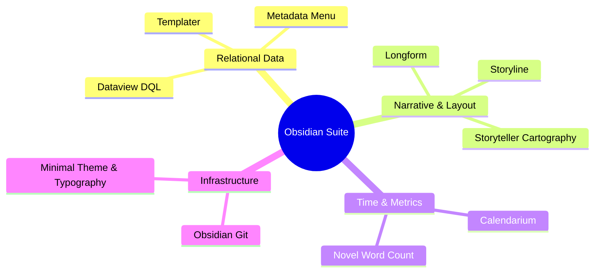

# Obsidian Sovereign Worldbuilding & Authoring Suite (`docs/guides/OBSIDIAN_PLUGINS.md`)
> **Domain A: Lore, Worldbuilding & Metadata Infrastructure**

---

## 1. Overview & Architectural Philosophy

The **Ars Arcanum Obsidian Suite** transforms a standard Markdown vault into an industrial-grade narrative operating system, relational database, dynamic visual story canvas, and worldbuilding concordance.

While standard Obsidian serves as a general-purpose note-taking tool, writing epic speculative fiction requires specialized data structures:
1. **Dynamic Lore Querying**: Instant relational tables listing all characters allied with a specific faction, their current alive/deceased status, and chapter appearances.
2. **Strict Frontmatter Schemas**: Validated dropdown fields and typed constraints preventing typos in character roles or dates.
3. **Non-Gregorian Astronomical Time**: Tracking multi-moon cycles, custom calendars, and overlapping timeline events.
4. **Automated Git Versioning**: Silent, background Git commits every 10 minutes without breaking flow state.

```
+-------------------------------------------------------------------------------+
|                    ARS ARCANUM OBSIDIAN INTEGRATION ARCHITECTURE              |
|                                                                               |
|  +--------------------+     Strict fileClass Schema   +--------------------+  |
|  | Markdown Note      | ----------------------------> | Metadata Menu &    |  |
|  | (Character/Faction)|                               | Dataview Relational|  |
|  +--------------------+                               +--------------------+  |
|            |                                                    |             |
|            v                                                    v             |
|  [Calendarium Time Engine]                            [Storyline Dynamic Web] |
|  (Custom Moons & Epochs)                              (Interactive Kinship)   |
|            |                                                    |             |
|            +----------------------------------------------------+             |
|                                     |                                         |
|                                     v                                         |
|                   +-----------------------------------+                       |
|                   |  Longform Drag-and-Drop Compiler  |                       |
|                   |  Novel Word Count Live Telemetry  |                       |
|                   |  Obsidian Git 10-Min Local Commits|                       |
|                   +-----------------------------------+                       |
|                                     |                                         |
|                                     v                                         |
|                     [The Sovereign Speculative World Bible]                   |
|                     [100% Local-First / Zero Cloud Telemetry]                 |
+-------------------------------------------------------------------------------+
```

---

## 2. Core Plugin Suite & Narrative Capabilities



| Plugin Name | Primary Narrative Function | Pre-Configured Capabilities & Workflows |
|---|---|---|
| **Dataview** | Relational Database & Queries | Executes DQL (Dataview Query Language) across character dossiers, faction rosters, and magic rules. |
| **Longform** | Manuscript Organization | Drag-and-drop scene ordering, atomic drafting pane, inline comment stripping (`%% note %%`), and Typst export bridge. |
| **Metadata Menu** | Frontmatter Schema Enforcement | Strict `fileClass` schemas with modal dropdowns, type checking, and auto-completion for YAML keys. |
| **Calendarium** | Astronomical & Calendar Mechanics | Non-Gregorian fictional calendars, custom month lengths, moon phase cycles, and in-world event agendas linked via `fc-date`. |
| **Storyline** | Character Relationship Matrix | Visual node graphs of alliances, rivalries, kinship trees, and character arc trajectories. |
| **Storyteller** | Spatial Interactive Cartography | Pins interactive lore nodes and settlement gazetteers directly to high-resolution world map images. |
| **Novel Word Count** | Live Explorer Telemetry | Injects live word counts beside every chapter, folder, and act in the file explorer tree. |
| **Obsidian Git** | Automated Local Version Control | Silent background Git commits every 10 minutes and on file close, with zero network requirements. |
| **Templater** | Dynamic Template Engine | Injects date math, UUIDs, folder context, and default frontmatter on note creation. |
| **Minimal Theme** | Literary Focus Typography | 42rem line measure optimization, true italic styling, custom ligatures, and distraction-free dark/sepia themes. |

---

## 3. Dynamic Dataview Relational Queries (DQL)

### 3.1 Active Character Roster by Faction
```sql
```dataview
TABLE role AS "Role", status AS "Status", origin AS "Origin"
FROM "World/Characters"
WHERE contains(faction, "House Vaelen") AND status != "Deceased"
SORT file.name ASC
```
```

### 3.2 Unfulfilled Prophecies & Ominous Timeline Clauses
```sql
```dataview
TABLE era_given AS "Era", oracle AS "Oracle / Source", intended_resolution AS "Target"
FROM "World/Prophecy"
WHERE fulfillment_status = "Unfulfilled"
SORT era_given ASC
```
```

---

## 4. Metadata Menu `fileClass` Schema Architecture

Schemas in `Templates/fileClasses/` strictly constrain YAML properties:

```yaml
# Character.md fileClass Schema Definition
property:
  name:
    type: "string"
    isRequired: true
  status:
    type: "select"
    options: ["Alive", "Deceased", "Missing", "Imprisoned", "Transcended"]
  role:
    type: "select"
    options: ["Protagonist", "Antagonist", "Deuteragonist", "Major Supporting", "Minor"]
  faction:
    type: "lookup"
    path: "World/Factions"
  timeline_birth:
    type: "number"
  threat_level:
    type: "number"
    min: 1
    max: 10
```

---

## 5. Plugin Supply-Chain Integrity & Cryptographic Manifest

To guarantee air-gapped security and defense against supply-chain tampering, all 10 bundled Obsidian plugins are tracked in a cryptographic SHA-256 manifest:

- **Manifest Location**: [`templates/world-bible/.obsidian/plugins/manifest.json`](file:///templates/world-bible/.obsidian/plugins/manifest.json)
- Every file (`main.js`, `manifest.json`, `styles.css`) is hashed with SHA-256 digests.
- Verified as part of the automated regression suite to ensure zero untracked code modifications.

---

## 6. Recommended Reading, References & Media

### 6.1 Knowledge Management & Worldbuilding Treatises
- **Ahrens, Sönke (2017)**. *How to Take Smart Notes: One Simple Technique to Boost Writing, Learning and Thinking*. CreateSpace. ISBN: 978-1542866507.  
  *The foundational guide to atomic note-taking, non-linear knowledge graphs, and Zettelkasten systems.*
- **Sanderson, Brandon (2020)**. *Managing Lore and Magic Systems in Long-Term Bibles*. Dragonsteel.  
  *How Brandon coordinates character dossiers and magic rules across decades of writing.*

### 6.2 Video Lectures, Masterclasses & Plugin Tutorials
- **Nicole van der Hoeven**: *Obsidian for Writers: The Complete Novel and Worldbuilding Guide*.  
  *Exhaustive video tutorials on Dataview queries, Longform manuscript drafting, and visual graphs.*
- **Artifexian**: *Fictional Calendars, Planetary Orbits, and Time Tracking for Worldbuilders*.  
  *Designing mathematically sound non-Gregorian calendars for fantasy worlds.*
- **Tale Foundry**: *How Lore Bibles Prevent Fictional Canon from Collapsing*.  
  *Deep-dive analysis into encyclopedic worldbuilding.*
