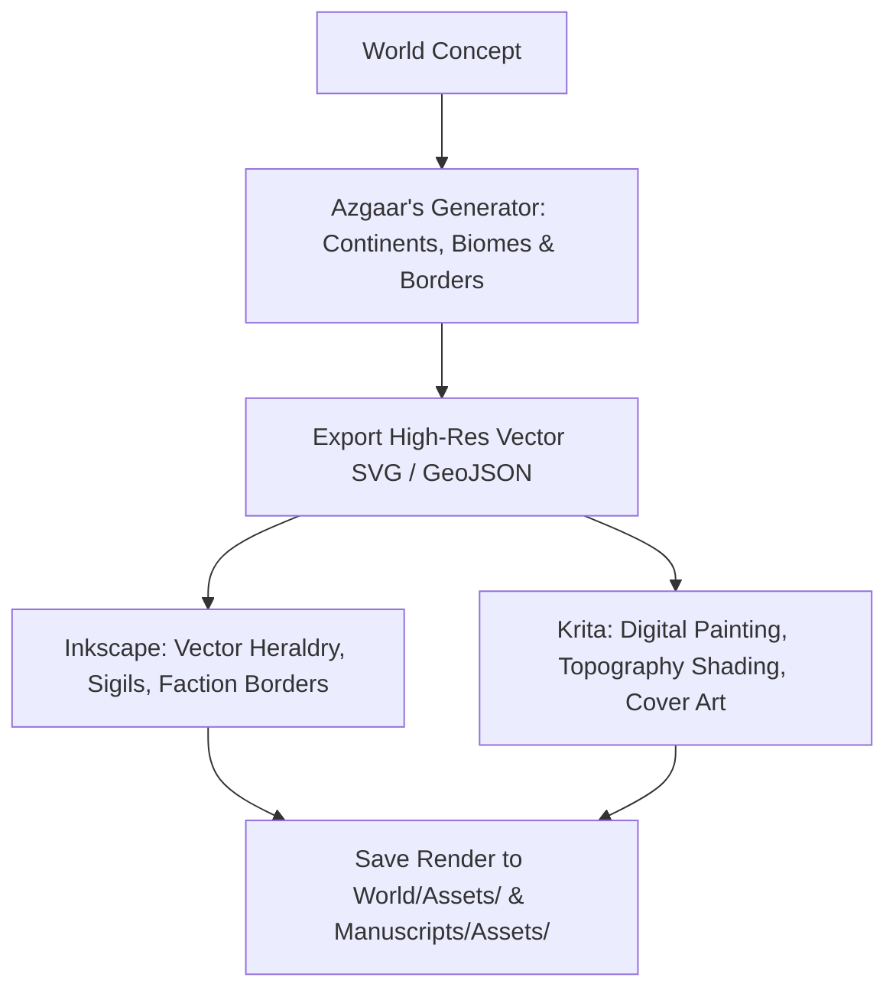

# Optional Extras & Specialized Open-Source Creative Tools Guide (`docs/guides/OPTIONAL_EXTRAS.md`)
> **Domain A & G: Worldbuilding & Publishing Tooling Ecosystem**

---

## 1. Overview & Tooling Philosophy

Ars Arcanum maintains a lean, zero-dependency core architecture that runs completely offline with standard Python and SQLite. However, when specialized artistic, cartographic, genealogical, or linguistic needs arise, the open-source software ecosystem offers world-class companion applications that integrate directly into your local workspaces.

```
+-------------------------------------------------------------------------------+
|                    ARS ARCANUM COMPANION TOOLING ECOSYSTEM                    |
|                                                                               |
|  [Cartography & Art]       --> Azgaar (Procedural), Krita, Inkscape (Sigils)  |
|                                                                               |
|  [Dynasties & Conlangs]    --> Gramps (Lineages), PolyGlot (Phonology)        |
|                                                                               |
|  [Air-Gapped Research]     --> Kiwix (Offline Wikipedia / ZIM Snapshot Dumps) |
|                                                                               |
|  [Post-Production E-Book]  --> Sigil (EPUB CSS & Typography Fine-Tuning)      |
|                                                                               |
|  [Guarantee: 100% Free, Open-Source, Zero Telemetry, Air-Gapped Capable]      |
+-------------------------------------------------------------------------------+
```

---

## 2. Cartography & Visual Worldbuilding



### 2.1 Azgaar's Fantasy Map Generator (Offline Setup)
- **Primary Function**: Procedural generation of continents, tectonic plates, biomes, river basins, political boundaries, culture distributions, and military trade routes.
- **Offline Air-Gapped Setup**:
  1. Download master repository archive: `https://github.com/Azgaar/Fantasy-Map-Generator/archive/refs/heads/master.zip`
  2. Extract to `~/Worlds/<WorldName>/Assets/Maps/Azgaar/`
  3. Open `index.html` in Firefox/Chromium with zero internet access.

### 2.2 Krita (Digital Painting & Visual Art)
- **Primary Function**: Hand-painted regional maps, concept illustrations, creature sketches, and full-color book jacket paintings.
- **Installation**:
  ```bash
  flatpak install -y flathub org.kde.krita
  # Or: sudo apt install -y krita
  ```

### 2.3 Inkscape (Vector Graphics & Faction Heraldry)
- **Primary Function**: Scalable vector coats of arms, royal seals, astronomical orbital diagrams, and custom typographic runes.
- **Installation**:
  ```bash
  sudo apt install -y inkscape
  ```

---

## 3. Specialized Worldbuilding & Linguistics Tools

### 3.1 Gramps (Genealogical Architecture & Dynasties)
- **Primary Function**: Standalone database for tracking thousands of historical lineage nodes, cadet branches, and complex inter-dynastic marriages.
- **Native Arcanum Alternative**: `arcanum genealogy <House>` compiles accessible Mermaid.js family tree diagrams directly into Obsidian notes.
- **Installation**:
  ```bash
  sudo apt install -y gramps
  ```

### 3.2 PolyGlot (Conlang Construction Studio)
- **Primary Function**: Constructed language phonology engine, lexicon manager, audio IPA pronunciation synthesizer, and orthography converter.
- **Native Arcanum Alternative**: `arcanum conlang generate <Lang>` and `arcanum conlang mutate <Lang>` execute historical sound-shift laws directly from Markdown files.
- **Installation**: Requires OpenJDK JRE. Run via `java -jar PolyGlot.jar`.

### 3.3 Kiwix (Offline Research & Complete Wikipedia Dumps)
- **Primary Function**: Complete air-gapped research capability. Download compressed `.zim` archives of Wikipedia (English, History, Physics, Biology) to an external drive and search encyclopedic knowledge without internet.
- **Installation**:
  ```bash
  flatpak install -y flathub org.kiwix.desktop
  ```

### 3.4 Sigil (EPUB Deep Inspection & CSS Editor)
- **Primary Function**: Direct editing of XHTML, CSS stylesheets, and embedded OpenType fonts inside compiled `.epub` files prior to distributor submission.
- **Installation**:
  ```bash
  sudo apt install -y sigil
  ```

---

## 4. Recommended Reading, References & Media

### 4.1 Digital Cartography & Visual Worldbuilding Treatises
- **Artifexian & Biblaridion**: *Vector Cartography, Plate Tectonics, and Coastline Realism*.  
  *Designing realistic geography using fractal heightmaps and hydraulic erosion.*
- **Rosenfelder, Mark (2010)**. *The Language Construction Kit*. Yonagu Books. ISBN: 978-0984144112.  
  *The defining manual on phonology, grammar, and historical morphology for worldbuilders.*

### 4.2 Software Documentation & Video Guides
- **Krita Foundation**: *Digital Painting Fundamentals for Concept Artists*. [krita.org/docs](https://krita.org/).  
  *Techniques for environmental rendering and digital world illustration.*
- **Inkscape Community**: *Vector Design for Book Covers, Heraldry, and Logos*. [inkscape.org](https://inkscape.org/).  
  *Mastering Bezier paths, node editing, and scalable typography.*
