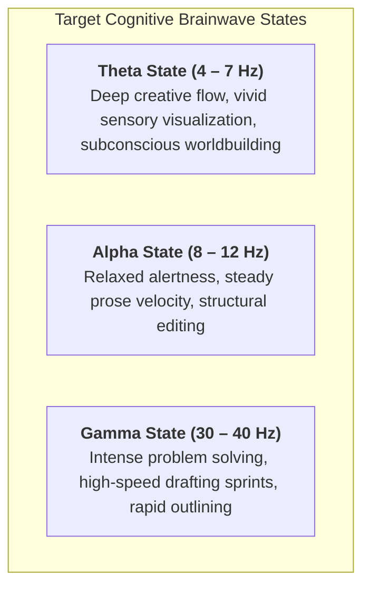

# Ambient Soundscapes, Focus Ergonomics & Sensory Atmosphere Guide
### Procedural Acoustic Soundscapes & Distraction-Free Drafting in Ars Arcanum

> [!NOTE] ⚠️ EDUCATIONAL TEMPLATE (AI-GENERATED)
> **Notice**: This template was AI-generated for educational demonstration and craft guidance within the Ars Arcanum operating system. It is strictly non-commercial and provided solely to demonstrate system features, mechanical schemas, and engine capabilities. Authors should replace placeholder values with their original drafting atmosphere preferences.

<details>
<summary>💡 <b>Ars Arcanum Engine Guidance & Feature Breakdown (Click to Expand)</b></summary>

### Features Demonstrated in This Guide:
- **Offline White/Pink/Brown Noise Synthesizer**: `ambient` (`arcanum ambient --preset rain --binaural 6.0`) — Procedurally generates offline noise layers, rain cycles, wind rumbles, and fireplace crackles using standard mathematical wave algorithms with zero external audio samples.
- **Binaural Frequency Tuner**: `ambient` (`arcanum ambient --binaural 4.5 --carrier 200`) — Renders precise differential binaural beat carriers: Theta (4.0–7.0 Hz, Deep Flow/Creativity), Alpha (8.0–12.0 Hz, Relaxed Focus), and Gamma (30.0–40.0 Hz, High-Velocity Problem Solving).
- **Distraction-Free Zen Editor**: `zen_studio` (`arcanum zen Book-01/01_Act_I/01_Chapter_01.md`) — Launches a pure-HTML offline drafting environment with typewriter line centering, word sprint meters, and collapsible In-Situ Lore Drawers.
- **Atmospheric Palette Mapper**: `senses` (`arcanum senses`) — Connects in-world weather and location acoustics directly to ambient drafting audio presets.

### How to Use for Your Projects:
1. Select the ambient preset that matches the scene you are currently writing (e.g. `highland_blizzard` for mountain chases).
2. Launch `arcanum ambient --preset <name>` in your terminal or trigger it from Studio Hub.
3. Use 25-minute Pomodoro intervals during sprint sessions to prevent auditory fatigue.
</details>

> *"Silence is not the absence of sound, but the presence of focus."*

---

## 1. Procedural Ambient Preset Matrix

Ars Arcanum generates 100% offline acoustic soundscapes via pure Python wave synthesis without streaming network bandwidth:

```
                                  [Master Ambient Mixer]
                                             │
             ┌───────────────────────────────┼──────────────────────────────┐
             ▼                               ▼                              ▼
    [Natural Meteorology]            [Sub-Planar Lore]              [Binaural Entrainment]
    • Pink Noise Rain (1/f)          • 432 Hz Ley Line Drone        • 6.0 Hz Theta (Flow)
    • Brown Noise Wind (1/f²)        • Deep Resonator Hum           • 10.0 Hz Alpha (Focus)
    • Random Hearth Crackles         • Waterwheel Flume Rhythm      • 40.0 Hz Gamma (Sprint)
```

| Preset Name | CLI Invocations | Frequency Layers & Modulations | Ideal Writing Scene Type |
| :--- | :--- | :--- | :--- |
| `high_sanctuary_rain` | `arcanum ambient --preset rain --binaural 6.0` | Steady pink noise rain on slate; distant rolling thunder ($f = 40\text{--}80\text{ Hz}$); 6 Hz Theta pulse. | Deep introspective drafting; dialogue scenes; quiet study. |
| `highland_blizzard` | `arcanum ambient --preset blizzard --wind-gusts` | Heavy brown noise wind gusts; low sub-bass rumble ($35\text{ Hz}$); crisp ice rattle. | High-tension chases; survival scenes; battle chapters. |
| `scriptorium_hearth` | `arcanum ambient --preset library --crackles 12` | Warm amber noise floor; stochastic wood fire crackles; muted clock tick. | Worldbuilding expansion; lore writing; cozy character moments. |
| `aether_rift_flux` | `arcanum ambient --preset arcane --carrier 432` | 432 Hz pure sine carrier with 8 Hz Alpha wobble; binaural stereo sweep. | Magic system duels; cosmic revelations; climax scenes. |

---

## 2. Binaural Frequency Entrainment Protocol



### Acoustic Parameters for Deep Focus:
- **Left Ear Carrier**: $200.0\text{ Hz}$
- **Right Ear Carrier**: $206.0\text{ Hz}$ (Yields exact $6.0\text{ Hz}$ Theta differential)
- **Volume Ratio**: Ambient Noise ($80\%$) : Binaural Pulse ($20\%$) to prevent ear strain over 2+ hour sessions.

---

## 3. Focus Ergonomics & Zen Drafting Setup

When preparing for a 2-hour authoring session:

1. **Terminal Launch**: Run `arcanum zen Manuscripts/Book-01/01_Act_I/01_Chapter_01.md --ambient high_sanctuary_rain --target 1500`.
2. **Typography Optimization**:
   - Line measure locked to 42–48 rem (~65–75 characters per line).
   - Base font set to *EB Garamond* or *Linux Libertine* (12pt).
   - High-contrast warm sepia background (`#1a1917` canvas, `#e6dfd3` text).
3. **In-Situ Lore Lookup**: Press `Alt + L` to slide out the search drawer and check character traits without alt-tabbing away from your prose.
