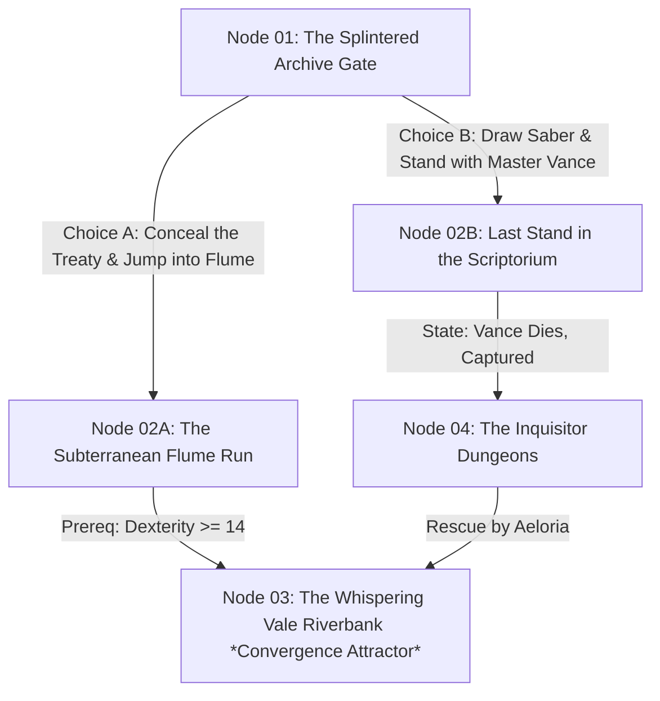

# Interactive Branching Narrative Graph & Choice Node Specification

> [!NOTE] ⚠️ EDUCATIONAL TEMPLATE (AI-GENERATED)
> **Notice**: This template was AI-generated for educational demonstration and craft guidance within the Ars Arcanum operating system. It is strictly non-commercial and provided solely to demonstrate system features, mechanical schemas, and engine capabilities. Authors should replace placeholder values with their original branching story design.

💡 <b>Ars Arcanum Engine Guidance & Feature Breakdown (Click to Expand)</b>

### Features Demonstrated in This Template:
- **Topological Dead-End Detector**: `branching_graph` (`arcanum branch audit Manuscripts/InteractiveNovel`) — Audits DAG topology to detect unreachable orphan nodes, cycle traps, and broken choice endpoints.
- **Subway Map HTML Exporter**: `branching_graph` (`arcanum branch graph Manuscripts/InteractiveNovel --html dist/branch_map.html`) — Compiles interactive multi-track narrative subway maps with state mutation visualizers.
- **Twine / Ink Transpiler**: `branching_graph` (`arcanum branch export Manuscripts/InteractiveNovel --format ink`) — Transpiles markdown choice nodes into industry-standard Ink and Twine Harlowe scripts.

### How to Use for Your Projects:
1. Use unique node identifiers (e.g. `Node_01_ArchiveGate`).
2. Specify choice options and state prerequisites.
3. Keep branching manageable by using periodic **Convergence Attractors** (funneling choices back to major act climaxes).

---

## 🌳 Interactive Narrative Branch Topology

---

## 📜 Choice Node Specification Ledger

### Node 01: The Splintered Archive Gate
- **Scene File**: `Book-01/01_Act_I/01_Chapter_01.md`
- **Dramatic Context**: Iron hammers smash through the lower archive gates. Scribes flee in terror.
- **Available Choices**:
  1. **Option A (The Flume Escape)**:
     - *Action*: Stuff the treaty into your tunic, kick open the waterwheel gate, and plunge into the rushing mountain flume.
     - *State Mutations*: `+1 Treaty_Fragments`, `-10 Armor_Integrity`.
     - *Next Target*: `Node 02A`.
  2. **Option B (The Heroic Defense)**:
     - *Action*: Draw your dueling saber, activate the silver focus pendant, and form a defensive square in front of Master Vance.
     - *Prerequisite*: `has_silver_pendant == true`.
     - *State Mutations*: `-2 Pendant_Charges`, `+1 Vance_Gratitude`.
     - *Next Target*: `Node 02B`.

---

## 🎯 Reconvergence Attractor Doctrine
To prevent combinatorial state explosion (2 $\to$ 4 $\to$ 8 $\to$ 16 branches), all branching paths must reconverge at major narrative anchor nodes at the end of each act (e.g. [[Factions/Tactical-Skirmish-Battle-Template|The-Battle-of-the-Silver-Ridge]]).
