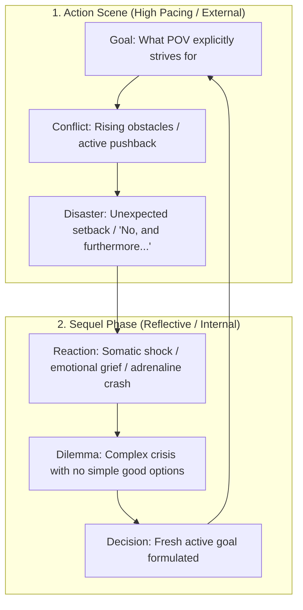

# Scene Mechanics & Micro-Pacing Blueprint
### Mastering Dwight Swain's Scene & Sequel Architecture in Ars Arcanum

> [!NOTE] ⚠️ EDUCATIONAL TEMPLATE (AI-GENERATED)
> **Notice**: This template was AI-generated for educational demonstration and craft guidance within the Ars Arcanum operating system. It is strictly non-commercial and provided solely to demonstrate system features, mechanical schemas, and engine capabilities. Authors should replace placeholder values with their original scene designs.

💡 <b>Ars Arcanum Engine Guidance & Feature Breakdown (Click to Expand)</b>

### Features Demonstrated in This Blueprint:
- **MRU Sequence Validator**: `scene_mechanics` (`arcanum scene audit Manuscripts/Book-01`) — Audits Motivation-Reaction Units to ensure strict physiological order: External Stimulus $\to$ Involuntary Feeling / Reflex $\to$ Conscious Action $\to$ Dialogue.
- **Disaster Hook Classifier**: `scene_mechanics` (`arcanum scene audit Manuscripts/Book-01 --disasters`) — Categorizes scene endings into *Yes, but...* (temporary setback) vs *No, and furthermore...* (escalating crisis).
- **Sentence Length Waveform**: `pacing` (`arcanum pacing Manuscripts/Book-01`) — Visualizes paragraph-by-paragraph sentence length variation across tension spikes.
- **Prose Mode Classifier**: `pacing` (`arcanum pacing Manuscripts/Book-01 --modes`) — Evaluates ratio of Dialogue (fast) vs Action (medium) vs Exposition/Introspection (slow).
- **8-Channel Sensory Scanner**: `senses` (`arcanum senses Manuscripts/Book-01`) — Scans prose for Visual, Auditory, Olfactory, Gustatory, Tactile, Kinesthetic, Thermal, and Aetheric sensory grounding.
- **White Room Syndrome Sweeper**: `senses` (`arcanum senses Manuscripts/Book-01 --sweep-white-room`) — Identifies dialogue-heavy passages lacking physical environment anchors.

### How to Use for Your Projects:
1. When a chapter feels slow or meandering, audit whether it has an explicit **Goal** and ends on a visceral **Disaster**.
2. Avoid skipping the **Sequel** phase after high-intensity climaxes; characters must physically and psychologically react to trauma before forming a new goal.
3. Balance dialogue lines with physical action beats rather than repetitive dialogue tags (*"he said"*, *"she muttered"*).

---

## ⚙️ The Dual-Engine Cycle: Scene vs. Sequel

---

## 🔍 The 6-Channel Sensory Immersion Matrix

To ensure deep immersion, every chapter should touch at least 4 of the 6 sensory channels:

| Sensory Channel | Somatic Prompt | Concrete In-World Prose Example |
| :--- | :--- | :--- |
| **1. Visual** | Light angle, contrasting textures, motion. | *"Silver moonlight sliced through the shattered leaded glass, illuminating floating dust motes above the pool of ink."* |
| **2. Auditory** | Background drone, sudden timbre changes. | *"The hollow groan of iron hinges broke the rhythmic patter of rain against the roof tiles."* |
| **3. Olfactory** | Atmospheric scent markers, weather odors. | *"The sharp bite of ozone and bitter pine resin overpowered the familiar mustiness of rotting vellum."* |
| **4. Gustatory** | Somatic mouthfeel, stress tastes. | *"The coppery tang of adrenaline coated the roof of his mouth as his teeth clamped down."* |
| **5. Tactile** | Surface textures, temperature gradients. | *"The damp limestone balustrade sucked the heat from his palms through worn leather gloves."* |
| **6. Kinesthetic** | Acceleration, balance, vertigo, exhaustion. | *"His center of gravity slipped on the rain-greased slate; gravity lurched sickeningly in his stomach."* |

---

## ✍️ Dialogue Craft: Action Beats over Tag Bloat

- ❌ **Avoid Dialogue Tag Bloat**:
  > *"We have to leave now," Kaelen said urgently. "They're at the gate," he added fearfully.*
- ✅ **Use Grounded Somatic Action Beats**:
  > *Kaelen slammed the heavy cedar folio shut and jammed the iron key into his belt.* *"We have thirty seconds before those hinges give way."*
