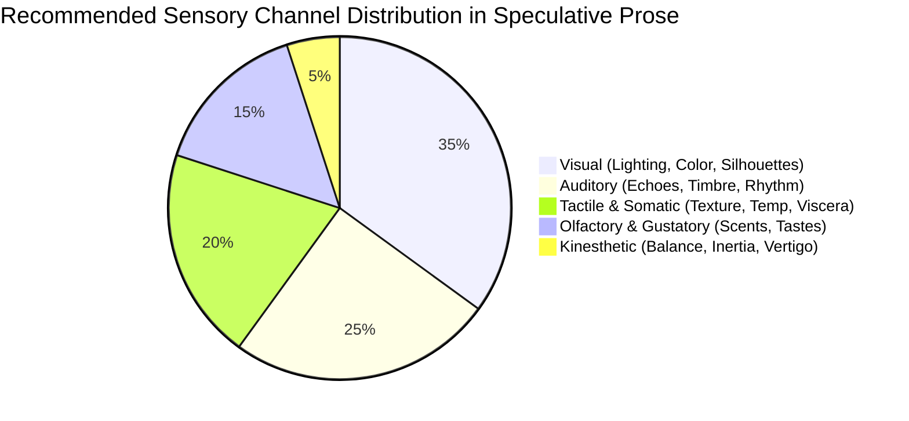

# Stylistics, Readability & Sensory Immersion Guide

> [!NOTE] ⚠️ EDUCATIONAL TEMPLATE (AI-GENERATED)
> **Notice**: This template was AI-generated for educational demonstration and craft guidance within the Ars Arcanum operating system. It is strictly non-commercial and provided solely to demonstrate system features, mechanical schemas, and engine capabilities. Authors should replace placeholder values with their original manuscript stylistics standards.

<details>
<summary>💡 <b>Ars Arcanum Engine Guidance & Feature Breakdown (Click to Expand)</b></summary>

### Features Demonstrated in This Guide:
- **Flesch-Kincaid Readability Auditor**: `stylistics` (`arcanum stylistics Manuscripts/Book-01`) — Analyzes Flesch-Kincaid Grade Level (target 6.8–7.8), passive voice ratio (<2.5%), and sentence length distribution.
- **Filter Word Stripper**: `stylistics` (`arcanum stylistics Manuscripts/Book-01 --filter-words`) — Pinpoints and strips sensory filters (*"he heard"*, *"she saw"*, *"he felt"*) to pull readers into direct immersion.
- **Sliding Window Echo Finder**: `stylistics` (`arcanum stylistics Manuscripts/Book-01 --echoes`) — Flags unintended word repetition within 3-paragraph sliding windows.
- **8-Channel Sensory Scanner**: `senses` (`arcanum senses Manuscripts/Book-01`) — Visualizes paragraph-level sensory engagement across 8 modalities.
- **White Room Syndrome Sweeper**: `senses` (`arcanum senses Manuscripts/Book-01 --sweep-white-room`) — Detects under-grounded scenes.
- **Voice Bleed Matrix & Idiolect Uniqueness Scorer**: `voice` (`arcanum voice Manuscripts/Book-01`) — Compares dialogue cadence, formality indices, and unique vocabulary across POV characters.

### How to Use for Your Projects:
1. Run `arcanum stylistics` during your second draft revision pass.
2. Aim for a target Flesch-Kincaid Grade Level between **6.0 and 8.5** for maximum narrative velocity without sacrificing literary elegance.
3. Eliminate passive constructions (*"was struck by"*) and filter phrases (*"he heard"*, *"she saw"*, *"he felt"*).
</details>

---

## 📊 Readability Benchmarks & Stylistic Targets

| Metric | Recommended Target | Diagnostic Purpose |
| :--- | :--- | :--- |
| **Flesch-Kincaid Grade Level** | `6.8 – 7.8` | Ensures prose flows effortlessly while allowing rich sensory vocabulary. |
| **Passive Voice Ratio** | `< 2.5%` of sentences | Keeps narrative momentum dynamic and character-driven. |
| **Weak Adverb Density** | `< 0.8 per 1,000 words`| Replaces lazy adverbs (*"shouted angrily"*) with precise active verbs (*"barked"*, *"snarled"*). |
| **Filter Word Frequency** | `< 1.2 per 1,000 words`| Eliminates unnecessary sensory filters (*"he noticed the cold"* $\to$ *"the cold bit his cheeks"*). |
| **Average Sentence Length** | `14 – 17 words` | Balances staccato action punches (4–7 words) with rhythmic descriptive clauses (22–30 words). |

---

## 🛠️ Filter Words: The Before & After Immersion Transformation

```
❌ DISTANT / FILTERED (Slows immersion):
   Kaelen saw the shadow moving across the floor. He could hear the sound of the guards 
   approaching and felt a cold wave of fear in his chest.

✅ DIRECT / VISCERAL IMMERSION (Ars Arcanum standard):
   A shadow stretched across the damp pine floorboards. Heavy boots echoed on the stone stairs. 
   Cold terror locked Kaelen's breath in his throat.
```

---

## 🎨 Sensory Distribution Balance Across Acts


