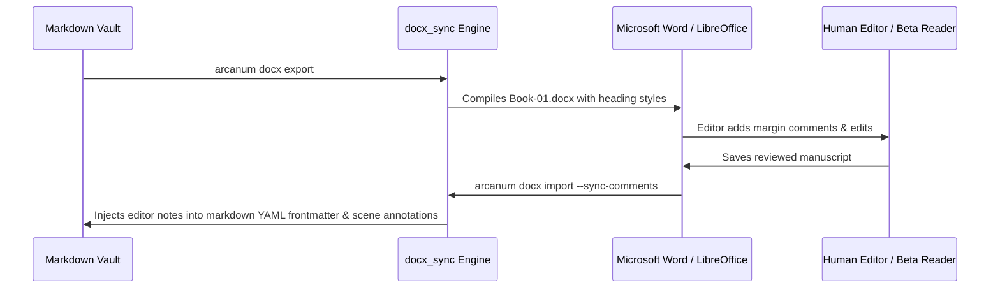

# Typography, Punctuation Standards & DOCX Synchronization

> [!NOTE] ⚠️ EDUCATIONAL TEMPLATE (AI-GENERATED)
> **Notice**: This template was AI-generated for educational demonstration and craft guidance within the Ars Arcanum operating system. It is strictly non-commercial and provided solely to demonstrate system features, mechanical schemas, and engine capabilities. Authors should replace placeholder values with their original manuscript formatting rules.

💡 <b>Ars Arcanum Engine Guidance & Feature Breakdown (Click to Expand)</b>

### Features Demonstrated in This Guide:
- **Smart Quotes Normalizer**: `typography_cleaner` (`arcanum typography clean Manuscripts/Book-01`) — Converts straight quotes to typographic curly quotes (“”), double hyphens (`--`) to em-dashes (—), number ranges to en-dashes (–), and inserts non-breaking spaces before dialogue dashes.
- **Dialogue Comma Splice Linter**: `typography_cleaner` (`arcanum typography clean Manuscripts/Book-01 --check-splices`) — Audits dialogue punctuation inside quotes (*"Like this," she said.*) and eliminates orphan double spaces.
- **Bidirectional Markdown-DOCX Sync**: `docx_sync` (`arcanum docx sync Manuscripts/Book-01`) — Converts Markdown manuscripts into formatted Word documents for beta readers/editors and synchronizes tracked edits back into markdown.
- **Conflict Branching**: `docx_sync` (`arcanum docx build Manuscripts/Book-01`) — Creates safe side-by-side `.conflict.md` branch files when simultaneous markdown and DOCX modifications occur.

### How to Use for Your Projects:
1. Run `arcanum typography clean` before exporting print PDFs or sending review copies.
2. Use standardized scene break markers (`***` or `* * *`) centered between scene transitions.
3. Keep dialogue punctuation inside quotation marks (*"Like this," she said.*).

---

## 🔤 Typographic Invariants & Standards

| Element | Incorrect / Raw Plaintext | Typographically Polished (Ars Arcanum Standard) |
| :--- | :--- | :--- |
| **Smart Quotes** | `"Hello," he said.` / `'Never.'` | `“Hello,” he said.` / `‘Never.’` |
| **Em-Dashes (Dialogue Breaks)**| `I never--he stopped.` | `I never— he stopped.` (Non-breaking em-dash) |
| **En-Dashes (Number Ranges)** | `pages 10-15` / `1240-1248` | `pages 10–15` / `1240–1248` |
| **True Ellipses** | `Wait... what?` | `Wait… what?` (`U+2026`) |
| **Scene Break Divider** | `---` or `
` | `* * *` (Centered typographic asterism) |
| **Double Spaces** | `Sentence.  Next sentence.` | `Sentence. Next sentence.` (Single space standard) |

---

## 🔄 Bidirectional Word (.docx) Workflow

