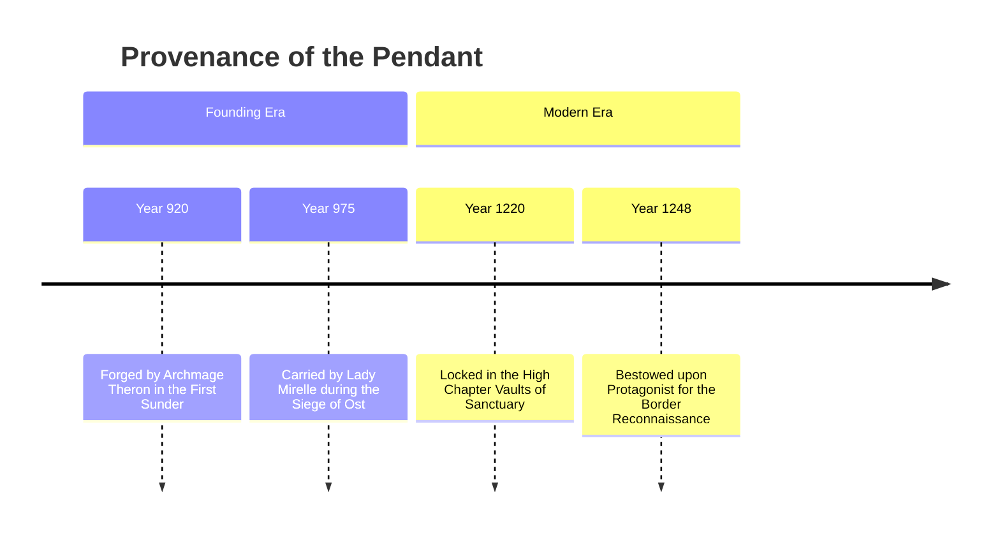

# <% tp.file.title %>

> [!NOTE] ⚠️ EDUCATIONAL TEMPLATE (AI-GENERATED)
> **Notice**: This template was AI-generated for educational demonstration and craft guidance within the Ars Arcanum operating system. It is strictly non-commercial and provided solely to demonstrate system features, mechanical schemas, and engine capabilities. Authors should replace placeholder values with their original worldbuilding details.

💡 <b>Ars Arcanum Engine Guidance & Feature Breakdown (Click to Expand)</b>

### Features Demonstrated in This Template:
- **Relic Attunement & Charge Degradation**: `magic_system` (`arcanum calc magic --artifact`) — Models finite charge capacities, dissipation rates, and mechanical wear on crystal matrices.
- **Cross-Volume Entity Tracking**: `continuity` & `series_continuity` (`arcanum continuity Manuscripts/Book-01`) — Ensures the artifact's bearer and location match across manuscript scenes and volumes.
- **Lore Provenance & Historical Graph**: Links directly to `timeline_event` notes for historical continuity audits.
- **Metadata Menu Integration**: Validated against `Templates/fileClasses/Artifact.md`.

### How to Use for Your Projects:
1. Specify `current_bearer` and `current_location` to prevent teleportation plot holes in draft audits.
2. Define clear mechanical costs and limitations in `danger_curse` so the artifact never becomes an unearned plot device.
3. Track charge states across chapter revisions.

> *"Whosoever holds the silver compass commands the wind, but gives their warmth to the stones."*

---

## 1. Physical Description, Aesthetics & Sensory Palette
- **Material & Metallurgy**: 99.9% refined Valdorian silver housing an uncut dodecahedral vitriol quartz crystal.
- **Visuals**: Delicate filigree depicting the celestial orbits of the three moons; faint cerulean luminescence pulsing in rhythm with the bearer's pulse.
- **Tactile & Somatic**: Sub-zero chill when dormant; radiates intense radiant heat when deflecting kinetic projectiles.
- **Acoustic**: Emits a faint 432 Hz harmonic hum when within 50 meters of an active aether rift.

---

## 2. Origin, Provenance & Historical Lineage

---

## 3. Magical Capabilities & Charge Ledger

| Function / Spell Tier | Charge Cost | Effect & Somatic Output |
| :--- | :--- | :--- |
| **Kinetic Deflection Pulse** | 1 Charge | Generates a 2-meter hemispherical barrier capable of deflecting high-velocity ballista bolts. |
| **Thermal Dissipation Shunt** | 2 Charges | Absorbs 100% of the caster's bodily waste heat, preventing hyperthermia during high-tier weaves. |
| **Aether Resonance Surge** | 3 Charges | Overclocks sensory perception for 30 seconds; reveals invisible ley lines and covert spell traps. |

---

## 4. Limitations, Curses & Failure Modes
- **Attunement Lock**: Requires the bearer to ingest a tincture of colloidal silver; attunement breaks if the bearer is unconscious for longer than 24 hours.
- **Thermal Feedback Curse**: If all 7 charges are expended within 10 minutes, the quartz fractures, releasing 5,000 kJ of stored thermal energy into the bearer's chest.
- **Method of Destruction**: Can only be unmade in the molten basalt core of Mount Vaelen.
