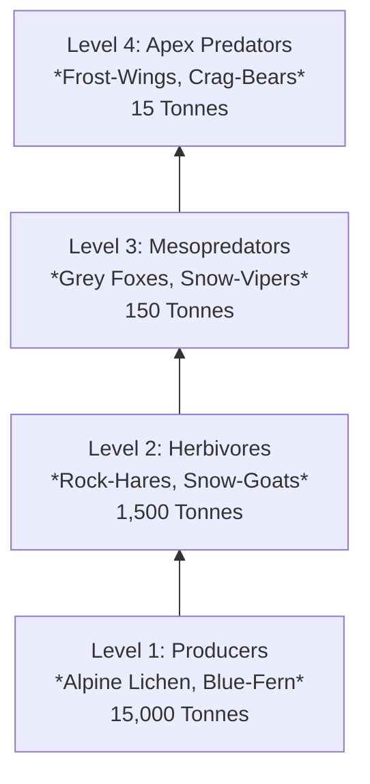

# <% tp.file.title %> — Ecosystem & Food Web Specification

> [!NOTE] ⚠️ EDUCATIONAL TEMPLATE (AI-GENERATED)
> **Notice**: This template was AI-generated for educational demonstration and craft guidance within the Ars Arcanum operating system. It is strictly non-commercial and provided solely to demonstrate system features, mechanical schemas, and engine capabilities. Authors should replace placeholder values with their original worldbuilding details.

💡 <b>Ars Arcanum Engine Guidance & Feature Breakdown (Click to Expand)</b>

### Features Demonstrated in This Template:
- **Trophic Energy Pyramid**: `ecology` (`arcanum ecology --biome temperate-forest --producers 15000000kg`) — Audits biomass ratios across producers, primary herbivores, mesopredators, and apex predators using Lindeman's 10% thermodynamic efficiency rule.
- **Kleiber Metabolic Sizer**: `ecology` (`arcanum ecology --beast-mass 65kg --diet carnivore`) — Calculates basal metabolic rate ($BMR \propto M^{0.75}$) and required daily prey consumption.
- **Square-Cube Skeletal Stress**: `ecology` (`arcanum ecology --creature-length 3.2m --terrestrial`) — Validates skeletal load-bearing cross-sections and flight feasibility for large speculative beasts.
- **Metadata Menu Integration**: Validated against `Templates/fileClasses/EcologyFoodWeb.md`.

### How to Use for Your Projects:
1. Define the primary producer baseline biomass (grasses, lichens, algae).
2. Establish the keystone species that holds the food web in equilibrium.
3. Use the trophic cascade scenarios to create organic ecological plot crises for your characters.

---

## 1. Trophic Pyramid & Biomass Distribution

| Trophic Tier | Representative Species | Total Biomass | Ecological Role |
| :--- | :--- | :--- | :--- |
| **Tier 1 (Producers)** | Alpine Lichen, Silver-Fern | 15,000 Tonnes | Fixes solar flux and mineral aether into edible carbohydrates. |
| **Tier 2 (Herbivores)** | [[Bestiary/Creature-Flora-Fauna-Template\|Highland-Rock-Hare]] | 1,500 Tonnes | **Keystone Species**: Controls brush fires; provides 70% of predator biomass. |
| **Tier 3 (Mesopredators)**| Montane Grey Fox | 150 Tonnes | Regulates rodent populations; scavenges high-altitude carcasses. |
| **Tier 4 (Apex Predators)**| [[Bestiary/Creature-Flora-Fauna-Template\|Frost-Wing-Stalker]] | 15 Tonnes | Enforces herbivore herd movement, preventing over-grazing on slopes. |

---

## 2. Keystone Species Dependency & Trophic Cascade Simulation

### What Happens if the [[Bestiary/Creature-Flora-Fauna-Template|Highland-Rock-Hare]] is Overhunted for Pelts?
1. **Immediate Impact (Months 1–6)**: Frost-Wing Stalkers and Crag-Bears face immediate 60% caloric deficits, driving them down into farming valleys to prey on livestock and villagers.
2. **Secondary Impact (Months 6–18)**: Alpine grass and brush grow unchecked, accumulating 300% dry biomass fuel load.
3. **Tertiary Catastrophe (Year 2)**: A single summer thunderstorm ignites catastrophic wildfire storms across the entire mountain range, destroying highland settlements.

---

## 3. Bioaccumulation of Arcane Contaminants
- **Contaminant**: *Aetheric Vitriol Salt* (byproduct of high-tier arcane mining).
- **Concentration in Alpine Water/Lichen**: $0.05 \text{ ppm}$ (Safe for human consumption).
- **Concentration in Rock-Hare Liver**: $0.5 \text{ ppm}$ (Mild gastrointestinal distress).
- **Concentration in Frost-Wing Fat Tissue**: $50.0 \text{ ppm}$ (Severe neuro-toxic psychosis).
- **Story Tension Hook**: Apex predators drinking from mine-tailing streams go berserk, attacking fortified trade caravans along the High Pass.
