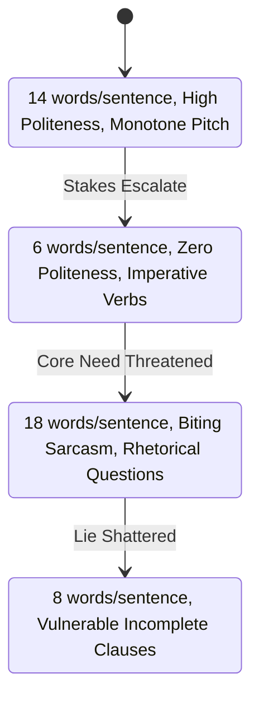

# <% tp.file.title %> — Character Voice Profile

> [!NOTE] ⚠️ EDUCATIONAL TEMPLATE (AI-GENERATED)
> **Notice**: This template was AI-generated for educational demonstration and craft guidance within the Ars Arcanum operating system. It is strictly non-commercial and provided solely to demonstrate system features, metadata schemas, and engine capabilities. Authors should replace placeholder values with their original worldbuilding details.

💡 <b>Ars Arcanum Engine Guidance & Feature Breakdown (Click to Expand)</b>

### Features Demonstrated in This Template:
- **Idiolect Uniqueness Scorer**: `voice` (`arcanum voice Manuscripts/Book-01 --character Kaelen`) — Evaluates vocabulary uniqueness, formality scores (0.0 to 1.0), and lexical richness (Type-Token Ratio) to ensure unmistakable character identity.
- **Voice Bleed Matrix**: `voice` (`arcanum voice Manuscripts/Book-01 --bleed-matrix`) — Measures cross-character dialogue homogenization and alerts when secondary characters begin sounding identical to the protagonist.
- **Sentence Length Waveform**: `pacing` (`arcanum pacing`) — Checks dialogue rhythm and average sentence length distribution across high-stakes vs quiet scenes.

### How to Use for Your Projects:
1. Create a voice profile note for each primary POV and major secondary character.
2. Link the voice profile to your character's main note in `voice_profile: "[[Character-Voice-Profile]]"`.
3. Use the Dialogue Samples section to calibrate your writing before drafting major confrontation scenes.

---

## 1. Quantitative Voice Metrics & Linguistic Baseline

| Linguistic Dimension | Metric Target | Narrative Effect |
| :--- | :--- | :--- |
| **Formality Score** | `0.78` (High) | Uses precise legalistic syntax; strictly avoids colloquial contractions (`do not` vs `don't`). |
| **Lexical Richness (TTR)**| `0.84` (Very High) | Employs nuanced academic and technical terminology from cartography and arcane physics. |
| **Avg Sentence Length** | `11.2 words` (Terse) | Keeps statements concise; delivers maximum information per breath during tactical negotiations. |
| **Interruption Frequency** | `Low (0.12)` | Rarely speaks out of turn; waits for interlocutor pauses before dissecting arguments. |

---

## 2. Distinctive Idiolect, Catchphrases & Sensory Lexicon

### Signature Vocabulary & Recurring Idioms:
- *"The ledger balance must hold."*
- *"Observe the vectors before committing the reserve."*
- *"A broken oath is merely debt with compounding interest."*

### Taboo Words & Syntax Habits:
- Never uses hyperbolic intensifiers like *"absolutely"*, *"totally"*, or *"insanely"*.
- Uses conditional subjunctive phrasing when discussing future risk: *"Should the perimeter yield..."* rather than *"If the wall falls..."*.

---

## 3. Emotional State Cadence Shifts

---

## 4. Benchmark Dialogue Samples

### Scenario A: High-Tension Military Negotiation
> *"The treaty stipulates thirty paces beyond the river boundary, Commander. If your vanguard advances a single step further, it constitutes an act of war under the Valdorian Concordat. Step back, or I will let the aether cannons calculate the difference."*

### Scenario B: Private Vulnerability & Emotional Confession
> *"I counted the fallen at the gate. Seventeen. I remembered every name, but none of their faces. That is what the command mantle takes from you first—the faces."*
