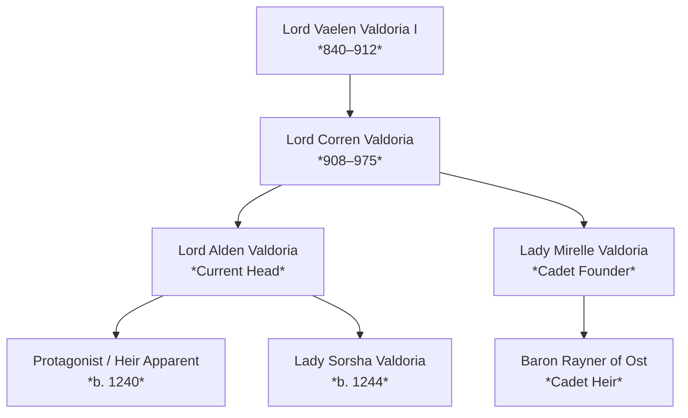

# <% tp.file.title %> — Dynastic House & Lineage

> [!NOTE] ⚠️ EDUCATIONAL TEMPLATE (AI-GENERATED)
> **Notice**: This template was AI-generated for educational demonstration and craft guidance within the Ars Arcanum operating system. It is strictly non-commercial and provided solely to demonstrate system features, mechanical schemas, and engine capabilities. Authors should replace placeholder values with their original worldbuilding details.

<details>
<summary>💡 <b>Ars Arcanum Engine Guidance & Feature Breakdown (Click to Expand)</b></summary>

### Features Demonstrated in This Template:
- **Succession Claim Roster**: `genealogy` (`arcanum genealogy --succession 'House Valdoria'`) — Generates legitimate inheritance claim rankings under Agnatic/Cognatic Primogeniture, Tanistry, or Ultimogeniture.
- **Wright Inbreeding Calculator**: `genealogy` (`arcanum genealogy --inbreeding-check 'Lord-Alden-Valdoria'`) — Calculates Wright's coefficient of relationship and consanguinity to prevent accidental genetic contradictions.
- **Charted Roots & Canvas Roots Integration**: `charted-roots` — Automatically builds interactive visual family trees on Obsidian Canvas directly from note frontmatter.
- **Mermaid Pedigree Exporter**: `genealogy` (`arcanum genealogy --mermaid 'House Valdoria'`) — Renders automatic visual family tree diagrams and Ahnentafel ancestor numbers.

### How to Use for Your Projects:
1. Define the `succession_law` and list the primary dynastic line.
2. In each individual character note, set `parents: [...]`, `spouses: [...]`, and `house: "[[House-Name]]"`.
3. Open with **Charted Roots** or run `arcanum genealogy` to generate pedigree lineage charts.
</details>

---

## 1. Dynastic Lineage & Succession Order



### Official Succession Queue:
1. **First Heir**: [[Characters/Character-Template|Protagonist]] (Eldest true-born child)
2. **Second Heir**: [[Characters/Character-Template|Lady-Sorsha-Valdoria]] (Second-born daughter)
3. **Third Heir**: [[Characters/Character-Template|Baron-Rayner-of-Ost]] (Cadet branch claim)

---

## 2. Dynastic Alliances, Marriages & Feuds

| House | Relationship | Strategic Treaty / Blood Covenant |
| :--- | :--- | :--- |
| **House Silverthorn** | Sworn Ally | Bound by the Treaty of the Three Spires (1180); mutual military defense pact. |
| **House Blackwood** | Neutral Trade Partner | Controls grain trade corridors through the Eastern March; non-aggression agreement. |
| **House Kaelen-Grip** | Bitter Blood Feud | Century-long dispute over the silver mines of Whispering Vale. |

---

## 3. Notable Historical Relics & Ancestral Assets
- **Ancestral Blade**: [[Artifacts/Artifact-Relic-Template|The-Silver-Verdict]] (Forged in 920 during the First Cataclysm).
- **Citadel & Fortifications**: [[Locations/Location-Template|High-Sanctuary]] — Imperial fortress built into the granite spires.
- **Primary Source of Wealth**: Aether-refining monopolies and toll rights along the Silver River.

---

## 4. Roster of Living Scions & House Members
```dataview
TABLE role as "Role", born as "Birth Year", title as "Title", current_location as "Location"
FROM #world/character
WHERE house = this.file.link OR contains(house, "Valdoria")
SORT born ASC
```
