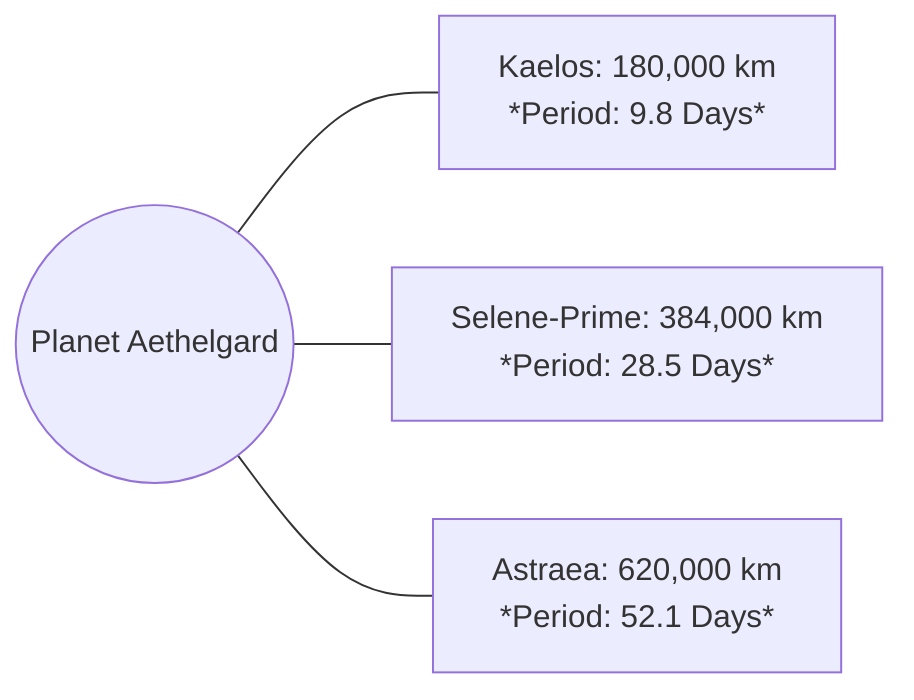

# <% tp.file.title %> — Astrophysics & Orbital Mechanics

> [!NOTE] ⚠️ EDUCATIONAL TEMPLATE (AI-GENERATED)
> **Notice**: This template was AI-generated for educational demonstration and craft guidance within the Ars Arcanum operating system. It is strictly non-commercial and provided solely to demonstrate system features, mechanical schemas, and engine capabilities. Authors should replace placeholder values with their original worldbuilding details.

<details>
<summary>💡 <b>Ars Arcanum Engine Guidance & Feature Breakdown (Click to Expand)</b></summary>

### Features Demonstrated in This Template:
- **Brachistochrone Transit**: `astrophysics` (`arcanum calc astro transit --distance 4.3ly --accel 1.0g`) — Computes continuous-acceleration burn-and-flip trajectory duration and peak turnover velocity ($t_{\text{ship}} = \frac{2c}{a} \cosh^{-1}(1 + \frac{ad}{2c^2})$).
- **Keplerian Ephemeris**: `astrophysics` (`arcanum calc astro orbit --star-mass 1.05 --semi-major 1.04`) — Solves Kepler's Third Law ($T^2 = a^3 / M_*$), stellar insolation flux ($S = L_*/d^2$), and Hill sphere envelope ($r_H \approx a (1-e) (m_p/3M_*)^{1/3}$).
- **Roche Limit & Rings**: `astrophysics` (`arcanum calc astro roche --planet-radius 6480 --density-ratio 1.2`) — Calculates rigid ($d_R = R_M (2 \rho_M/\rho_m)^{1/3}$) and fluid Roche limits ($d_f \approx 2.44 R_M (\rho_M/\rho_m)^{1/3}$), validating moon stability and planetary ring boundaries.
- **Time Dilation Converter**: `astrophysics` (`arcanum calc astro dilation --velocity 0.95c --proper-years 2.0`) — Translates ship proper time to coordinate time via Lorentz factor ($\gamma = 1/\sqrt{1 - v^2/c^2}$).

### How to Use for Your Projects:
1. Specify your primary star's mass and luminosity to automatically compute the habitable zone bounds ($d_{\text{HZ}} = \sqrt{L_*/S}$).
2. Configure moon orbits to ensure all satellites orbit comfortably inside the Hill sphere ($r_H \approx 1,540,000 \text{ km}$) and well outside the fluid Roche limit ($15,800 \text{ km}$).
3. Use exact light-lag communication delays and Lorentz dilation to build high-stakes narrative tension in sci-fi/space-opera subplots.
</details>

---

## 1. Stellar Ephemeris & Habitable Zone Envelope

```
  [G2V Star: 1.05 M☉] 
         |
         ├── (0.75 AU) Inner Habitable Zone (Runaway Greenhouse Boundary)
         |
         ├── (1.04 AU) 🌍 [Aethelgard: 1.08 M⊕] — Solar Flux: 1,365 W/m² | Year: 378.4 Days
         |
         └── (1.45 AU) Outer Habitable Zone (Maximum Greenhouse Limit)
```

| Parameter | Aethelgard Value | Earth Reference | Physical & Narrative Significance |
| :--- | :--- | :--- | :--- |
| **Semi-Major Axis ($a$)**| `1.04 AU` | 1.00 AU | Slightly extended year length; moderate seasonal thermal swings. |
| **Orbital Period ($T$)** | `378.4 Days` | 365.25 Days | Calendar divided into 12 months of 31–32 days. |
| **Surface Gravity ($g$)**| `1.03 g (10.1 m/s²)` | 1.00 g | Near-identical biological weight and ballistic projectile arcs. |
| **Fluid Roche Limit** | `15,800 km` | 18,470 km | Innermost moon (Kaelos at 180,000 km) is 11x safely outside ring disruption zone. |

---

## 2. Multi-Moon Orbital Architecture & Tidal Resonances



- **Tidal Range**: The three moons produce complex tidal harmonics. When all three reach conjunction (Syzygy every 420 days), coastal spring tides rise by up to 8.4 meters, flooding the low docks of coastal trading cities.
- **Eclipse Windows**: Kaelos transits across the solar disc twice a month, creating brief 12-minute shadow twilights known culturally as the *Falcon's Wink*.

---

## 3. Relativistic Brachistochrone Transit Ledger (Sci-Fi / Space Opera Sub-System)

### Continuous 1g Acceleration Transit from Aethelgard to Outer System Colony (42 AU):
- **Midpoint Turnover Distance**: 21 AU (Continuous 1.0g burn, flip 180°, 1.0g deceleration).
- **Peak Velocity at Turnover**: $v_{\text{max}} = 0.042 c \approx 12,600 \text{ km/s}$.
- **Total Transit Duration**: 28.6 Earth Days (Ship Frame and Planetary Frame nearly identical).
- **Light-Lag Communication Latency**: 5.8 Hours one-way (creates 11.6-hour command response cycles for military fleets).
