# <% tp.file.title %> — Calendar & Multi-Moon Planetary Chronology

> [!NOTE] ⚠️ EDUCATIONAL TEMPLATE (AI-GENERATED)
> **Notice**: This template was AI-generated for educational demonstration and craft guidance within the Ars Arcanum operating system. It is strictly non-commercial and provided solely to demonstrate system features, mechanical schemas, and engine capabilities. Authors should replace placeholder values with their original worldbuilding details.

<details>
<summary>💡 <b>Ars Arcanum Engine Guidance & Feature Breakdown (Click to Expand)</b></summary>

### Features Demonstrated in This Template:
- **Synodic Lunar Phase Tracker**: `calendar` (`arcanum calendar --date 1442-08-15 --phases`) — Computes real-time illumination percentages (New, Crescent, Quarter, Gibbous, Full) for all orbiting moons simultaneously.
- **Multi-Moon Conjunction Auditor**: `calendar` (`arcanum calendar --syzygy-scan 50years`) — Forecasts rare triple/quadruple moon syzygies, solar/lunar eclipses, and extreme tidal surges.
- **Calendarium Obsidian Plugin Integration**: `calendarium` — Direct compatibility with custom in-vault calendars, custom months, leap rules, and `fc-date` timeline events.
- **Intercalary Leap Year Rule**: `calendar` (`arcanum calendar --validate-drift`) — Applies custom intercalary festival days and leap algorithms to keep seasonal solstices and equinoxes mathematically synchronized.

### How to Use for Your Projects:
1. Define your world's exact `days_per_year`, month names, and moon synodic cycle durations.
2. In your manuscript chapter headers, use `@time: 1248-04-15` so the engine can look up the exact lunar phase and weather state for that scene.
3. Align religious holidays, magical rituals, and military campaigns to major celestial conjunctions.
</details>

---

## 1. Calendar Structure & Invariant Chronology

```
[378 Total Solar Days per Year]
├── 11 Standard Months × 31 Days = 341 Days
├── 1 Final Month × 31 Days      =  31 Days
└── 1 Intercalary Midsummer Festival = 6 Days (Dedicated to the Solar Primarch)
```

| Month # | Month Name | In-World Season | Astronomical Milestone / Conjunction |
| :--- | :--- | :--- | :--- |
| **01** | `Dawn-Reach` | Early Spring | Spring Vernal Equinox (Day 15) |
| **04** | `High-Sun` | High Summer | Approaching Summer Solstice |
| **—** | `Mid-Year-Festival`| Intercalary | **Summer Solstice**: 6 Days of continuous daylight feasts |
| **07** | `Gold-Reap` | Autumn Harvest | Autumnal Equinox (Day 200) |
| **10** | `Shadow-Deep` | Mid-Winter | **Winter Solstice**: Longest night of the solar year |

---

## 2. Multi-Moon Phase Mechanics & Conjunction Ledger

```mermaid
gantt
    title Moon Phase Synchronization (First 60 Days)
    dateFormat X
    axisFormat Day %s
    section Kaelos (9.8d)
    Full Moon 1 : 0, 5
    New Moon 1  : 5, 10
    Full Moon 2 : 10, 15
    section Selene (28.0d)
    Waxing Crescent : 0, 14
    Full Moon       : 14, 28
    Waning Gibbous  : 28, 42
    section Astraea (52.1d)
    First Quarter   : 0, 26
    Full Moon       : 26, 52
```



### Celestial Phenomena:
- **The Crimson Eclipse (Kaelos & Selene Conjunction)**: Occurs every 39.2 days. Kaelos passes directly behind Selene, casting a reddish corona across the night sky.
- **The Grand Triad Syzygy**: All three moons enter Full Phase on the same night every 420 days. High tides surge by +8 meters; wild beasts in the highlands become hyper-aggressive.

---

## 3. Manuscript Scene Timekeeping Tags
When drafting, reference exact in-world calendar dates:
```markdown
# Chapter 4: The Night of Three Moons
@pov: Protagonist
@time: 1248-05-18 (Mid-Year-Festival Day 3)
@moon_phase: Grand Conjunction (Triad Full)
```
Ars Arcanum automatically parses these dates during consistency audits to verify that character travel times match elapsed days.
