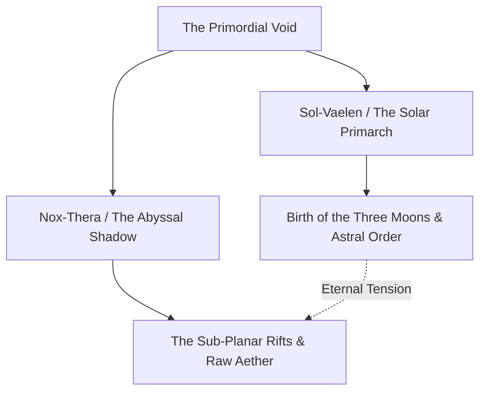

# <% tp.file.title %>

> [!NOTE] ⚠️ EDUCATIONAL TEMPLATE (AI-GENERATED)
> **Notice**: This template was AI-generated for educational demonstration and craft guidance within the Ars Arcanum operating system. It is strictly non-commercial and provided solely to demonstrate system features, mechanical schemas, and engine capabilities. Authors should replace placeholder values with their original worldbuilding details.

💡 <b>Ars Arcanum Engine Guidance & Feature Breakdown (Click to Expand)</b>

### Features Demonstrated in This Template:
- **Pantheon & Mythos Architecture**: `cosmology` (`arcanum calc astro`) — Bridges theology with physical celestial constants, solar cycles, and orbital mechanics.
- **Calendar & Timekeeping Synchronizer**: `calendar` (`arcanum calendar`) — Directly configures planetary day lengths, month divisions, weekday cycles, and moon periods for in-universe date tracking.
- **Ecclesiastical Faction Alliances**: Links religious dogmas with political power structures in `factions` and holy relics in `artifacts`.

### How to Use for Your Projects:
1. Define the metaphysical domain and whether the deity is an active living entity, an abstract ideal, or an ancient cosmic construct.
2. Link the associated religious orders and sacred festivals to dates in your in-world calendar.
3. Establish clear theological taboos and heresies that drive character dilemmas and moral conflicts.

> *"Before the first stone was shaped, the Solar Primarch cast the first shadow across the void."*

---

## 1. Mythic Identity, Avatars & Cosmic Domain
- **Primordial Essence**: Represents the fundamental force of radiant electromagnetic energy and mathematical order in the cosmos.
- **Manifestations**: Appears in mortal visions as an imposing winged figure wrought from white-gold flame clutching a crystal armillary sphere.
- **Sacred Sigils & Constellations**: The Radiant Falcon, located within the Zenith Ring during the Summer Solstice.

---

## 2. Creation Genesis & The Mythic Schism

---

## 3. Ecclesiastical Doctrine, Worship & Holy Rites
- **High Priesthood**: The Solar Synod, headquartered in the [[Locations/Location-Template|High-Sanctuary]].
- **Sacred Festivals**:
  - *The Feast of the Zenith Sun* (Midsummer Solstice, Day 182): 24-hour vigil of continuous prayer and flame illumination.
  - *The Night of the Triad Eclipse* (Every 7 Years): Fasting and solemn repentance as the three moons align.
- **Heresies & Inquisitions**: The practice of blood-aether weaving is deemed the Ultimate Heresy, punishable by binding and exile to the Outer Salt Flats.

---

## 4. Divine Relics & Arcane Interventions
- **Sacred Artifact**: [[Artifacts/Artifact-Relic-Template|The-Solar-Conduit]] — Purported to hold the distilled breath of the Primarch.
- **Granted Miracles**: Grants high-tier Aether-Weavers enhanced thermal absorption buffers during solar noon rites.
