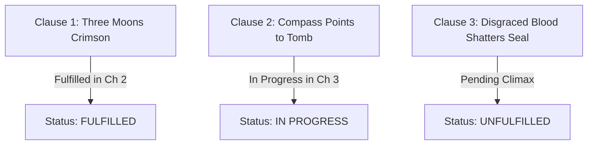

# <% tp.file.title %>

> [!NOTE] ⚠️ EDUCATIONAL TEMPLATE (AI-GENERATED)
> **Notice**: This template was AI-generated for educational demonstration and craft guidance within the Ars Arcanum operating system. It is strictly non-commercial and provided solely to demonstrate system features, mechanical schemas, and engine capabilities. Authors should replace placeholder values with their original worldbuilding details.

💡 <b>Ars Arcanum Engine Guidance & Feature Breakdown (Click to Expand)</b>

### Features Demonstrated in This Template:
- **Clause Fulfillment Matrix**: `prophecy` (`arcanum prophecy World-Bible/`) — Tracks clause-by-clause fulfillment progression across acts and volumes (Fulfilled, Subverted, Broken, Self-Fulfilling, False).
- **Delphic Ambiguity Analyzer**: `prophecy` (`arcanum prophecy World-Bible/ --ambiguity`) — Parses double-meanings and linguistic loopholes in oracle utterances to enable organic narrative twists.
- **Oracle Provenance Tracker**: `prophecy` (`arcanum prophecy World-Bible/ --provenance`) — Traces original utterance records, political alterations, and transmission corruption over centuries.
- **Metadata Menu Integration**: Validated against `Templates/fileClasses/Prophecy.md`.

### How to Use for Your Projects:
1. Break your prophecy into discrete, testable poetic clauses.
2. Maintain competing in-world interpretations between rival factions.
3. Track clause status (`unfulfilled` -> `partially_fulfilled` -> `subverted`) as your manuscript advances.

> *"When the three moons burn crimson at the solstice, the silver compass shall point to an open tomb, and a child of disgraced blood shall shatter the crystal seal."*

---

## 1. Context, Oracle Utterance & Recording Provenance
- **Oracle / Speaker**: Spoken by [[Characters/Character-Template|Archmage-Theron]] during the fevered aftermath of the First Sunder in Year 940.
- **Historical Record**: Transcribed upon iron plates and preserved in the subterranean archives of [[Locations/Location-Template|High-Sanctuary]].
- **Public Perception**: The Order preaches that the "child of disgraced blood" is an enemy of the realm who must be executed on sight; the underground resistance views the child as a liberator.

---

## 2. Clause-by-Clause Analysis & Fulfillment Matrix

| Clause # | Verse Text | Competing Faction Interpretations | Current Narrative Status |
| :--- | :--- | :--- | :--- |
| **Clause 1** | *"When the three moons burn crimson at the solstice"* | **Order**: A literal apocalyptic omen. **Scholars**: Standard astronomical conjunction. | **Fulfilled** (Occurred during the eclipse in Chapter 2). |
| **Clause 2** | *"The silver compass shall point to an open tomb"* | **Order**: The desecration of the royal crypts. **Protagonist**: An ancient subterranean aether-well. | **In Progress** (Discovered in Chapter 3). |
| **Clause 3** | *"A child of disgraced blood shall shatter the crystal seal"* | **Order**: The total destruction of Valdoria. **True Subversion**: The shattering releases trapped souls, purifying the land. | **Unfulfilled** (Target of the Act III Climax). |

---

## 3. Narrative Subversion Strategy & Thematic Payoff
- **The Twist**: The antagonist believed "shattering the seal" meant unleashing forbidden dark magic to claim the throne. Protagonist fulfills the prophecy by shattering the seal's power siphon, permanently democratizing magic and eliminating the tyrannical monopoly.
