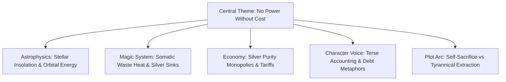

# <% tp.file.title %> — Cross-Domain Resonance Mesh

> [!NOTE] ⚠️ EDUCATIONAL TEMPLATE (AI-GENERATED)
> **Notice**: This template was AI-generated for educational demonstration and craft guidance within the Ars Arcanum operating system. It is strictly non-commercial and provided solely to demonstrate system features, mechanical schemas, and engine capabilities. Authors should replace placeholder values with their original worldbuilding details.

💡 <b>Ars Arcanum Engine Guidance & Feature Breakdown (Click to Expand)</b>

### Features Demonstrated in This Template:
- **Knowledge Mesh Visualizer**: `resonance` (`arcanum resonance mesh --html dist/mesh.html`) — Generates an interactive offline visual graph of all 53 engines and world entities.
- **Deterministic Causal Cascade**: `resonance` (`arcanum resonance cascade astrophysics --param axial_tilt --val 38.5`) — Simulates downstream repercussions of parameter changes across disparate fields.
- **Creative Spark Synthesizer**: `resonance` (`arcanum resonance spark astrophysics conlang economy`) — Generates multidisciplinary analogies and plot premises connecting disparate domains.
- **Multi-Hop Conceptual Bridge**: `resonance` (`arcanum resonance bridge astrophysics voice`) — Finds conceptual pathways connecting two arbitrary craft domains.
- **Cross-Domain Coherence Audit**: `resonance` (`arcanum resonance audit`) — Validates mutual mathematical and narrative consistency across all engine files.

### How to Use for Your Projects:
1. Identify your story's central thematic question or foundational physical principle.
2. Map how that principle echoes across magic, economics, language idioms, and character arcs.
3. Use the Causal Cascade table to pressure-test changes to your world's core lore before revising draft manuscripts.

---

## 1. Cross-Domain Resonance Topology

---

## 2. Multidisciplinary Conceptual Bridge Matrix

| Domain A | Domain B | Conceptual Bridge & Narrative Synergy |
| :--- | :--- | :--- |
| **Astrophysics (Orbits)** | **Calendar / Religion** | The 420-day Grand Conjunction dictates the liturgical calendar and imperial coronation windows. |
| **Magic (Thermodynamics)**| **Economy (Silver)** | Because pure silver is required as an arcane heat sink, the state forbids the export of un-minted bullion. |
| **Conlang (Phonotactics)**| **Character Voice** | High-born characters avoid glottal stops, mirroring their polished crystalline architecture. |
| **Ecology (Food Web)** | **Military Logistics** | Famine in the hare population forces predator attacks on army supply baggage trains. |

---

## 3. Causal Cascade Simulation: "What if Aether Heat Dissipation is Doubled?"
If an author modifies the thermodynamic efficiency of Aether Weaving in `world.yaml`:
1. **Magic System Impact**: Casters overheat in half the time; high-tier battles become shorter and more lethal.
2. **Economic Impact**: Silver demand spikes by +140%; silver coin debasement causes rampant merchant riots in High Sanctuary.
3. **Tactical Impact**: Pike infantry squares replace battle-mage skirmishers as the primary military doctrine.
4. **Manuscript Pacing Impact**: Climax action sequence must rely on physical swordcraft and terrain rather than continuous spell duels.
