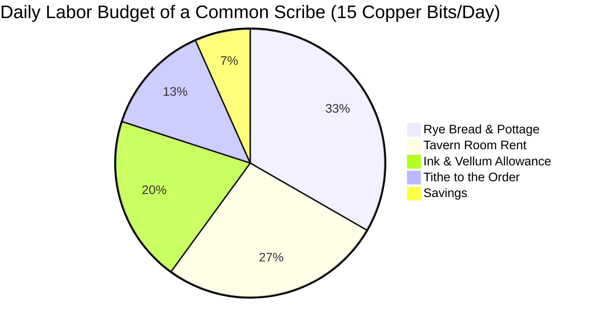

# <% tp.file.title %> — Macroeconomics & Currency Standards

> [!NOTE] ⚠️ EDUCATIONAL TEMPLATE (AI-GENERATED)
> **Notice**: This template was AI-generated for educational demonstration and craft guidance within the Ars Arcanum operating system. It is strictly non-commercial and provided solely to demonstrate system features, mechanical schemas, and engine capabilities. Authors should replace placeholder values with their original worldbuilding details.

<details>
<summary>💡 <b>Ars Arcanum Engine Guidance & Feature Breakdown (Click to Expand)</b></summary>

### Features Demonstrated in This Template:
- **Commodity Price Calculator**: `economy` (`arcanum calc economy --tech medieval --basket standard`) — Computes realistic commodity basket price distributions, purchasing power parity, and unskilled daily labor wages.
- **Coinage Debasement Simulator**: `economy` (`arcanum calc economy --debase-silver 0.35`) — Models Gresham's Law, debasement inflation, and specie hoard runs when silver bullion purity drops.
- **Trade Route Friction & Tariffs**: `economy` — Calculates transportation surcharges and customs tolls along primary trade corridors like [[Locations/Cartography-Route-Template|High-Pass-Road]].

### How to Use for Your Projects:
1. Choose your world's `tech_era` and set the `base_currency`.
2. Define a realistic `commodity_basket` to keep everyday tavern and equipment purchases grounded.
3. Use debasement and smuggling tensions to drive economic plotlines in your narrative.
</details>

---

## 1. Monetary Policy & Currency Denominations

```
  [1 Aether-Bar (Refined)] = 25 Valdorian Sovereigns
           │
  [1 Valdorian Silver Sovereign (Base: 1.0)] = 10 Silver Shillings = 100 Copper Bits
           │
  [1 Silver Shilling (0.1)] = 10 Copper Bits
           │
  [1 Copper Bit (0.01)] = Baseline for 1 pint of ale or half a loaf of bread
```

| Denomination | Composition & Purity | Weight (Grams) | In-World Purchasing Power |
| :--- | :--- | :--- | :--- |
| **Aether-Bar** | Crystalline vitreous silver | 250 g | Purchases 3 warhorses or 1 month of garrison rations. |
| **Silver Sovereign**| 92.5% Sterling Silver | 12.0 g | 10 days of skilled mason or soldier wages. |
| **Silver Shilling** | 50.0% Billon Silver | 3.5 g | 1 day of unskilled laborer wages; 5 loaves of rye bread. |
| **Copper Bit** | 98.0% Smelted Bronze | 4.0 g | 1 pint of common ale, 1 bowl of tavern pottage, or 1 toll fee. |

---

## 2. Standard Commodity Basket (Purchasing Power Parity)



- **Daily Unskilled Labor**: 10 Copper Bits
- **Daily Skilled Soldier / Scribe**: 15–20 Copper Bits
- **Standard Iron Sword**: 150 Copper Bits (1.5 Sovereigns — ~10 days of soldier pay)
- **Highland Destrier Warhorse**: 800 Copper Bits (8 Sovereigns — Major capital investment)
- **Tier 2 Vitriol Focus Pendant**: 2,500 Copper Bits (25 Sovereigns — Guild luxury asset)

---

## 3. Trade Corridors, Monopolies & Supply Shocks
- **The Silver Monopoly**: The Order retains exclusive sovereign rights to mint bullion coins. Melting coins for jewelry carries the death penalty.
- **Supply Shock Scenario (The Winter Road Blockade)**: When blizzards close the [[Locations/Cartography-Route-Template|High-Pass-Road]] for 3 weeks, grain prices in High Sanctuary surge from 2 Copper to 12 Copper per loaf, triggering street bread riots.
