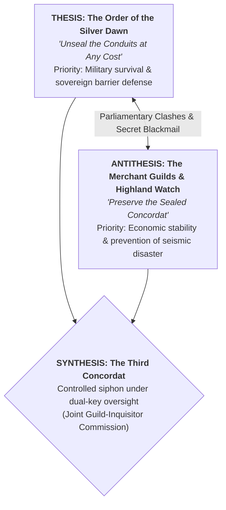

# <% tp.file.title %> — Deliberative Council & Narrative Dialectics

> [!NOTE] ⚠️ EDUCATIONAL TEMPLATE (AI-GENERATED)
> **Notice**: This template was AI-generated for educational demonstration and craft guidance within the Ars Arcanum operating system. It is strictly non-commercial and provided solely to demonstrate system features, mechanical schemas, and engine capabilities. Authors should replace placeholder values with their original worldbuilding and narrative debate details.

<details>
<summary>💡 <b>Ars Arcanum Engine Guidance & Feature Breakdown (Click to Expand)</b></summary>

### Features Demonstrated in This Template:
- **Multi-Perspective Dialectic Engine**: `council` (`arcanum council debate World-Bible/ --council 'The Conclave'`) — Models formal philosophical arguments, ideological tensions, and parliamentary maneuvers across factions.
- **Tension & Voting Coalition Matrix**: `council` (`arcanum council --coalitions`) — Analyzes voting blocs, swing votes, leverage points, and compromise thresholds ($V_{\text{pass}} \ge T_{\text{super}}$).
- **Hegelian Dialectic Tracker**: `council` (`arcanum council --dialectics`) — Structures council scenes through Thesis (Orthodox Order) $\to$ Antithesis (Radical Reform / Commercial Freedom) $\to$ Synthesis (Unexpected New Compromise / Crisis).
- **4-Perspective Editorial Evaluation**: `council` (`arcanum council audit Manuscripts/Book-01`) — Connects in-world council deliberations with the four craft lenses: Plot Doctor, Lore Auditor, Voice Coach, and Sensory Stylist.
- **Calendarium & Dataview Integration**: Automatically binds with `fc-date` for in-world calendar timelines and dynamic faction attendee tables.

### How to Use for Your Projects:
1. Define the `central_dispute`, setting high political stakes where no option is morally simple or cost-free.
2. Assign clear faction arguments (Thesis vs. Antithesis) with logical, justifiable self-interests.
3. Use the Swing Vote & Leverage Ledger to create dramatic pivot points during council chamber scenes.
4. Conclude with a binding decree or deadlock that forces characters into decisive chapter action.
</details>

> *"When swords clash, blood is spilled; when councils debate, entire dynasties are erased with a stroke of a quill."*

---

## 1. Executive Summary & Geopolitical Stakes

The Conclave of the Seven Spires was convened in the Grand Scriptorium of [[Locations/Location-Template|High-Sanctuary]] during the summer of Year 1248. Prompted by escalating skirmishes along the northern frontier, the council was tasked with deciding whether to unseal the forbidden thermal conduits of Mount Vaelen to energize city ward barriers.

- **Presiding Officer**: [[Characters/Character-Template|Archmage-Theron]] (Neutral Arbiter)
- **Quorum Requirement**: Minimum 8 voting delegates present (9 attending)
- **Primary Stakes**: Voting to unseal risks triggering a geological cataclysm; voting against leaves the border forts vulnerable to Cabal siege.

---

## 2. Dialectic Architecture: Thesis, Antithesis & Synthesis



---

## 3. Delegate Roster & Voting Alignment Matrix

| Delegate | Faction Represented | Stance / Bloc | Core Leverage / Vulnerability | Final Vote |
| :--- | :--- | :--- | :--- | :--- |
| [[Characters/Character-Template\|Archmage-Theron]] | Solar Synod | Neutral Arbiter | Bound by ancient oaths of impartiality | **Abstain** |
| [[Characters/Character-Template\|Lord-Alden-Valdoria]] | [[Characters/Genealogy-Dynasty-Template\|House Valdoria]] | Pro-Unsealing (Thesis) | Holds northern border defense command | **Aye (For)** |
| [[Characters/Character-Template\|Lord-Kaelen]] | [[Factions/Faction-Template\|The-Shadow-Cabal-of-Ost]] | Clandestine Obstructionist | Secretly funding insurgent miners | **Nay (Against)** |
| [[Characters/Character-Template\|Aeloria-Vael]] | [[Factions/Faction-Template\|The-Highland-Watch]] | **Swing Vote** | Demands tax relief for border villages | **Aye (Swung)** |

---

## 4. Chamber Rhetoric, Debate Rounds & Dramatic Pivots

### Round 1: The Opening Injunction (Formal Oratory)
- Lord Alden presents the fractured treaty fragment recovered in Chapter 1, arguing that border garrisons will fall within 14 days without aether-barrier reinforcement.
- The Guild representative counters, citing the historical records of the Cataclysm of 920 ([[History/Timeline-Event-Template|The-Great-Sunder]]) and warning that unsealing will vaporize the mountain water table.

### Round 2: The Evidence Reveal & Moral Pivot
- *Dramatic Turn*: [[Characters/Character-Template|Protagonist]] steps forward with the [[Artifacts/Artifact-Relic-Template|Silver-Focus-Pendant]], demonstrating that thermal feedback can be shunted safely into silver conduits without fracturing the tectonic plates.
- The revelation breaks the deadlock, swinging the Highland Watch delegates from staunch opposition to conditional support.

### Round 3: The Secret Leverage & Compromise
- To secure the final 2/3 supermajority, the Order concedes a 20% tariff reduction on highland wool and timber, formalizing the joint commission.

---

## 5. Binding Resolutions & Manuscript Repercussions

1. **Decree Promulgated**: The subterranean vaults of High Sanctuary are opened under dual supervision.
2. **Immediate Narrative Hook**: Protagonist is appointed Lead Envoy of the Joint Commission, placing them directly in the crosshairs of Cabal assassins in Act II.
3. **World State Mutation**: Faction tensions between the Merchant Guilds and the Order ease from *Hostile* to *Cautious Alliance*.

---

## 6. Associated Lore & Delegate Registry
```dataview
TABLE role as "Role", faction as "Faction", status as "Status"
FROM #world/character
WHERE contains(faction, "Order-of-the-Silver-Dawn") OR contains(faction, "Merchant-Guilds") OR contains(faction, "Highland-Watch")
SORT file.name ASC
```
