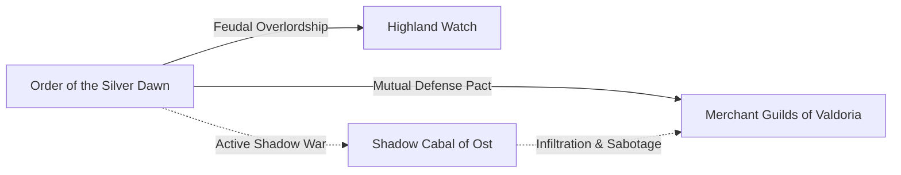

# <% tp.file.title %>

> [!NOTE] ⚠️ EDUCATIONAL TEMPLATE (AI-GENERATED)
> **Notice**: This template was AI-generated for educational demonstration and craft guidance within the Ars Arcanum operating system. It is strictly non-commercial and provided solely to demonstrate system features, mechanical schemas, and engine capabilities. Authors should replace placeholder values with their original worldbuilding details.

<details>
<summary>💡 <b>Ars Arcanum Engine Guidance & Feature Breakdown (Click to Expand)</b></summary>

### Features Demonstrated in This Template:
- **Diplomatic Paradox Sweeper**: `factions` (`arcanum factions --audit-paradoxes`) — Audits triangular treaty networks for contradictory mutual defense commitments and impossible alliance pacts.
- **Alliance Matrix Exporter**: `factions` (`arcanum factions --matrix --html dist/diplomacy_matrix.html`) — Generates an interactive diplomacy matrix, alliance webs, and rivalry tension graphs.
- **Macroeconomic Leverage & Upkeep**: `economy` — Models state treasuries, guild embargoes, and military upkeep costs.
- **Tactical Roster Synthesis**: Automatically integrates with `tactical_sim` to supply standing troop counts and unit compositions for simulated field battles.
- **Metadata Menu Integration**: Validated against `Templates/fileClasses/Faction.md`.

### How to Use for Your Projects:
1. List all `allies`, `rivals`, `vassals`, and `treaties` using exact `[[Faction-Name]]` wikilinks.
2. Define both public ideological dogma and secret council motives to generate compelling political drama.
3. The embedded Dataview query automatically updates with all characters sworn to this faction.
</details>

> *"No fortress falls from external siege until the gates are unlocked from within."*

---

## 1. Executive Summary & Geopolitical Mandate
The Order of the Silver Dawn was chartered in the 8th Century to guard the northern mountain passes against abyssal incursions. Today, it operates as an autonomous sovereign military-monastic state, wielding supreme judicial and arcane authority across the northern high provinces.

---

## 2. Diplomatic Alignments & Geopolitical Tension



| Faction | Status | Active Treaty / Strategic Friction |
| :--- | :--- | :--- |
| **[[Factions/Faction-Template\|The-Merchant-Guilds]]** | Allied | Treaty of the Lower Basin: The Order provides armed escorts in exchange for a 15% tariff rebate. |
| **[[Factions/Faction-Template\|The-Highland-Watch]]** | Vassal | Sworn feudal banner; supplies 1,500 scout rangers during wartime mobilization. |
| **[[Factions/Faction-Template\|The-Shadow-Cabal-of-Ost]]**| Hostile | Unsanctioned covert skirmishes along the border; vying for control of the ancient aether-wells. |

---

## 3. Organizational Structure & Internal Ranks
- **High Chapter Council**: Nine Grand Inquisitors headed by the Lord Commander.
- **Knight-Marshals**: Commanders of provincial garrisons and logistics networks.
- **Aether-Weavers**: Battle-mages embedded directly within frontline heavy infantry squares.
- **Acolytes & Sentinels**: Initiates undertaking the Seven Vows of Vigilance.

---

## 4. Military Assets & Mobilization Capacity
- **Heavy Cataphracts**: 2,500 armored shock cavalry mounted on highland destriers.
- **Silver-Pike Squares**: 8,000 disciplined infantry armed with 5-meter aether-infused pikes.
- **Arcane Artillery**: 40 stationary siege-trebuchets firing concentrated glass-fire canisters.
- **Quartermaster Reserves**: 6 months of dried grain stockpiled in the mountain granaries of High Sanctuary.

---

## 5. Roster of Sworn Members
```dataview
TABLE role as "Role", title as "Title", current_location as "Location"
FROM #world/character
WHERE faction = this.file.link
SORT file.name ASC
```
