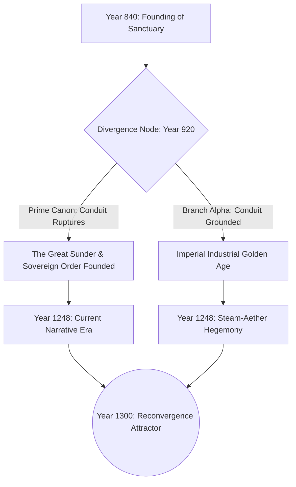

# <% tp.file.title %> — Causal Graph & Timeline Branch

> [!NOTE] ⚠️ EDUCATIONAL TEMPLATE (AI-GENERATED)
> **Notice**: This template was AI-generated for educational demonstration and craft guidance within the Ars Arcanum operating system. It is strictly non-commercial and provided solely to demonstrate system features, mechanical schemas, and engine capabilities. Authors should replace placeholder values with their original worldbuilding details.

💡 <b>Ars Arcanum Engine Guidance & Feature Breakdown (Click to Expand)</b>

### Features Demonstrated in This Template:
- **CTC Paradox Sweeper**: `causality` (`arcanum causality audit`) — Computes Directed Acyclic Graph (DAG) causal flows and audits Closed Timelike Curves for grandfather, bootstrap, and predestination paradox loops.
- **Multiverse Branch Visualizer**: `causality` (`arcanum causality branch Alpha-920 --divergence-point 920`) — Renders interactive branching multiverse trees comparing world state deltas across timelines.
- **Bilocation Conflict Detector**: `timeline_sync` (`arcanum timeline sync`) — Validates that characters and relics cannot exist simultaneously in separate geographic or temporal coordinates without explicit branching mechanisms.
- **Anachrony Visualizer**: `timeline_sync` (`arcanum timeline sync --anachrony`) — Maps historical flashbacks and framing chronologies against linear narrative time.

### How to Use for Your Projects:
1. Specify the exact historical event and year where the branch diverges from the prime canon.
2. Enumerate key societal and geographical mutations caused by the alternate outcome.
3. Use the Causal DAG graph to maintain rigorous internal consistency across time-travel or multi-timeline novels.

---

## 1. Causal Graph Topology & Divergence Tree

---

## 2. Comparative Matrix: Prime Canon vs. Alternate Branch Alpha

| Dimension | Prime Canon (Sunder Happened) | Branch Alpha (Sunder Prevented) |
| :--- | :--- | :--- |
| **Dominant Power** | [[Factions/Faction-Template\|Order-of-the-Silver-Dawn]] (Monastic State) | High Imperial Dynasty of Valdoria (Central Monarchy) |
| **Magic Availability** | Strictly regulated; silver sinks mandatory | Mass-produced in city factories; consumer aether lamps |
| **Geography** | 185-km chasm pass connects north and south | Impassable mountain spine forces maritime trade supremacy |
| **Protagonist Role** | Exiled inquisitor uncovering ancient secrets | High-ranking court engineer defending imperial patent rights |

---

## 3. Ontological Stability & Paradox Safeguards
- **Paradox Index ($P = 0.18$)**: The divergence does not erase the origin point of the timeline observer, keeping timeline collapse risk minimal.
- **Grandfather Invariant**: No time traveler can alter events prior to their own birth without creating an isolated parallel pocket dimension.
- **Causal Attractor Theory**: Despite vastly different technological trajectories, both timelines face catastrophic mana depletion in Year 1300 due to fixed planetary orbital constraints.
