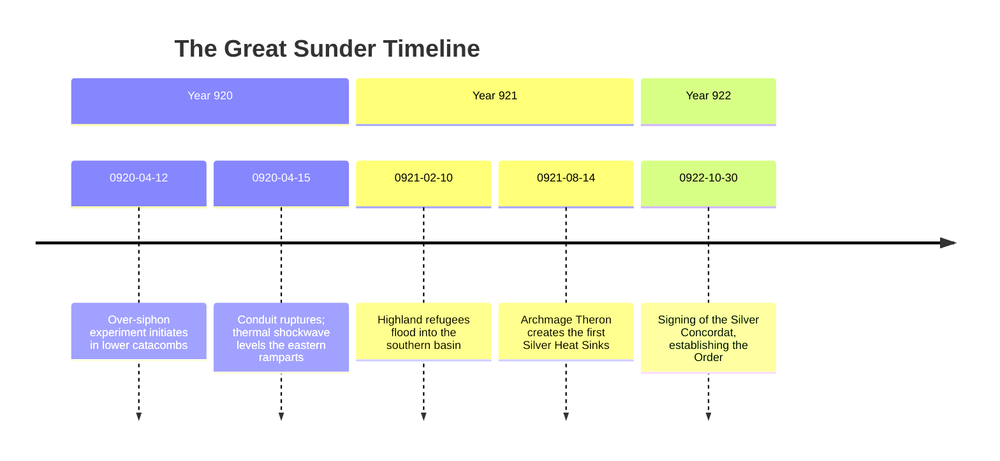

# <% tp.file.title %>

> [!NOTE] ⚠️ EDUCATIONAL TEMPLATE (AI-GENERATED)
> **Notice**: This template was AI-generated for educational demonstration and craft guidance within the Ars Arcanum operating system. It is strictly non-commercial and provided solely to demonstrate system features, mechanical schemas, and engine capabilities. Authors should replace placeholder values with their original worldbuilding details.

💡 <b>Ars Arcanum Engine Guidance & Feature Breakdown (Click to Expand)</b>

### Features Demonstrated in This Template:
- **Historical Chronology & Timeline Validator**: `world_doctor` & `continuity` (`arcanum doctor`) — Validates chronological date ranges (`start_year` $\le$ `end_year`), era ordering (`1e` < `2e` < `3e`), and verifies that characters active in this event were alive during these dates.
- **Dual-Track Timeline Synchronization**: `timeline_sync` (`arcanum timeline sync`) — Synchronizes master historical chronological timestamps with narrative chapter flashback scenes.
- **Causal Precursor & Dependency Ledger**: Interlocks with `causality` to prevent circular historical causality.

### How to Use for Your Projects:
1. Use consistent integer years (`920`) or ISO dates (`0920-04-12`) in frontmatter.
2. Link all participating characters and locations with wikilinks.
3. Use the Chronological Sequence of Events to provide rich historical flavor for characters referencing ancient wars in dialogue.

> *"The sky split like dry vellum, and the silver towers drank the fire of the stars."*

---

## 1. Executive Chronicle & Historical Significance
In Year 920 of the Second Era, an unsanctioned experiment to draw infinite thermal energy from sub-planar aether ruptured the primary mantle conduit beneath High Sanctuary. The resulting geological cataclysm collapsed three mountain peaks, gave birth to the Whispering Vale, and permanently transformed the geopolitical balance of the continent.

---

## 2. Chronological Sequence of Events

---

## 3. Structural Repercussions & Modern Legacy
- **Geological Transformation**: Formed the 185-km chasm now known as the [[Locations/Cartography-Route-Template|High-Pass-Road]].
- **Technological Revolution**: Banned raw ungrounded spellcasting; mandated the use of [[Artifacts/Artifact-Relic-Template|Silver-Focus-Pendants]].
- **Political Reordering**: Abolished the feudal high monarchy, granting perpetual sovereignty to the [[Factions/Faction-Template|Order-of-the-Silver-Dawn]].

---

## 4. Historiographical Bias & Competing Accounts
- **The Order's Orthodoxy**: Preaches that divine intervention halted the cataclysm to punish the hubris of the ancient kings.
- **The Cabal's Underground Revision**: Asserts the Order deliberately triggered the rupture to seize control of the silver mines.
- **The Archival Truth**: Discovered in forbidden scrolls—the rupture was an accidental feedback loop caused by solar flare conjunctions.
