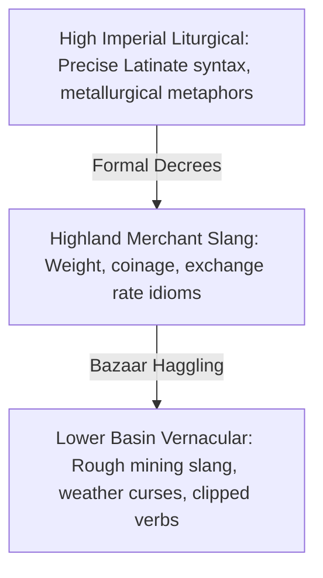

# <% tp.file.title %> — Speculative Idioms, Proverbs & Cultural Metaphors

> [!NOTE] ⚠️ EDUCATIONAL TEMPLATE (AI-GENERATED)
> **Notice**: This template was AI-generated for educational demonstration and craft guidance within the Ars Arcanum operating system. It is strictly non-commercial and provided solely to demonstrate system features, mechanical schemas, and engine capabilities. Authors should replace placeholder values with their original conlang idioms, proverbs, and cultural expressions.

<details>
<summary>💡 <b>Ars Arcanum Engine Guidance & Feature Breakdown (Click to Expand)</b></summary>

### Features Demonstrated in This Template:
- **Speculative Idiom & Proverb Auditor**: `idioms` (`arcanum idioms audit World-Bible/`) — Audits fictional expressions to ensure they ground directly in your world's astrophysics, climate, history, religion, and magic systems rather than recycling Earth clichés (*"raining cats and dogs"*).
- **Metaphor Domain Mapper**: `idioms` (`arcanum idioms --domains`) — Categorizes cultural worldview schemas into physical anchor domains (Glaciers, Mining, Conduits, Solar Flares).
- **Phonetic Collision & Dialect Consistency**: Integrates with `conlang` and `voice` to verify that character idiolects use culturally appropriate proverbs matched to their origin and social class.
- **Rootweave & LanguageForge Integration**: Morphemic etymology links directly to the root lexicon and conlang phonology.

### How to Use for Your Projects:
1. Ground your culture's proverbs in their primary environmental dangers (e.g. frost, altitude, flash floods, mana rifts).
2. Create tiered expressions for different social classes: High Liturgical, Military Tactical, and Vernacular Street Slang.
3. Ensure characters use idioms that reflect their specific trade or magical discipline during high-emotion dialogue.
</details>

> *"Do not weigh your silver while the forge is still roaring."*

---

## 1. Cultural Worldview & Dominant Metaphor Schemas

In the harsh, alpine climate of the Aethelgard Highlands, language reflects survival, thermodynamic balance, and the sanctity of written contracts. highland culture has no patience for flowery abstractions—truth is measured in weight, heat, and structural tensile strength.

```
       [Alpine Environmental Reality]
            │  (Freezing winds, glacial scree, altitude sickness)
            ▼
       [Primary Conceptual Metaphor]
       "LIFE IS A THERMAL LEDGER; VIRTUE IS RESISTANCE TO HEAT"
            │
            ├── Physical Virtue: "Cold Blood / Steady Hand"
            ├── Social Sin: "Over-boiling / Siphoning Without Conductor"
            └── Moral Oath: "To Keep the Hearth Paved"
```

---

## 2. Comprehensive Master Idiom & Proverb Matrix

| Idiomatic Expression | Literal Meaning / Etymology | Context of Use & Emotional Valence | English Earth Equivalent |
| :--- | :--- | :--- | :--- |
| **"To pour water on hot silver"** | An amateur metallurgist destroying a cooling ingot. | Used when someone delivers catastrophic news with disastrous, hasty timing. | *"Adding fuel to the fire"* / *"Barging in blindly"* |
| **"Measure the wind before cursing the storm"** | Mountain archers testing high-altitude crosswinds before shooting. | Advice given to hot-headed young inquisitors seeking reckless revenge. | *"Look before you leap"* / *"Pick your battles"* |
| **"A draft with no chimney"** | An ungrounded spellcaster drawing ambient aether into a cold room. | Denotes an untrustworthy person who makes loud promises without putting up collateral. | *"All bark and no bite"* / *"Empty vessel"* |
| **"Walking the scree at midnight"** | Traversing loose glacial shale in pitch darkness without a torch. | Describing a wildly dangerous, desperate gamble with razor-thin margins of survival. | *"Skating on thin ice"* / *"Playing with fire"* |
| **"The third seal holds"** | Refers to the three historical leaden seals on the High Treaty of Sanctuary. | A solemn expression of resolute calm during impending catastrophe or siege. | *"Stand firm"* / *"Hold the line"* |

---

## 3. Greetings, Farewells, Superstitious Oaths & Battle Cries

### Formal & Liturgical Exchanges:
- **Greeting**: *"May your conductors stay cool and your ink stay wet."*
- **Response**: *"And may the frost never breach your threshold."*

### Superstitious Oaths & Sworn Pledges:
- *"By the three cold sisters (the three moons), my word is cast in lead."*
- *"If I lie, let my blood boil in the silver crucible."*

### Battlefield Invectives & Taunts:
- *"Go chew limestone!"* (Street insult directed at foreign mercenaries).
- *"Your mother wove with rotten hemp!"* (Deep insult regarding arcane or ancestral lineage).

---

## 4. Dialect & Sociolect Variations



---

## 5. Associated Conlang Roots & Lexicon Registry
```dataview
TABLE language_family as "Family", status as "Status", spoken_by as "Speakers"
FROM #world/language
WHERE contains(spoken_by, "Valdoria") OR contains(file.name, "Conlang")
SORT file.name ASC
```
