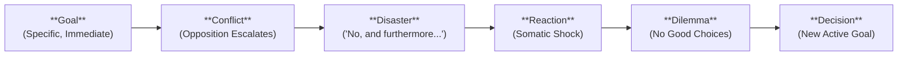

# Scene: <% tp.file.title %>

> [!NOTE] ⚠️ EDUCATIONAL TEMPLATE (AI-GENERATED)
> **Notice**: This template was AI-generated for educational demonstration and craft guidance within the Ars Arcanum operating system. It is strictly non-commercial and provided solely to demonstrate system features, mechanical schemas, and engine capabilities. Authors should replace placeholder values with their original scene outlines.

💡 <b>Ars Arcanum Engine Guidance & Feature Breakdown (Click to Expand)</b>

### Features Demonstrated in This Template:
- **Scene Mechanics & Dwight Swain Architecture**: `scene_mechanics` (`arcanum scene audit`) — Formally structures scenes into **Action Scenes** (Goal $\to$ Conflict $\to$ Disaster) or **Sequels** (Reaction $\to$ Dilemma $\to$ Decision).
- **Pacing & Dialogue Rhythm**: `pacing` (`arcanum pacing`) — Enforces sentence length variance, white space balance, and dialogue density matched to `pacing_intensity`.
- **Sensory Immersion Heatmap**: `senses` (`arcanum senses`) — Prompts for all 6 sensory modalities to guarantee somatic reader grounding.
- **Story Canvas & Corkboard Sync**: `story_canvas` (`arcanum canvas`) — Reads frontmatter cards into the interactive visual Corkboard.

### How to Use for Your Projects:
1. Choose between **Scene** (external obstacle) and **Sequel** (internal emotional processing).
2. Define the exact **Disaster Outcome** (*Yes, but...* or *No, and furthermore...*) so the story cannot stall.
3. Use the Emotional Value Shift to ensure every scene alters the character's status quo.

---

## 🎯 The Dwight Swain Scene Mechanics Engine

### 1. Scene Phase (External Action):
- **Immediate Scene Goal**: Finish copying the imperial treaty before the night bell chimes.
- **Opposing Conflict**: Master Vance enters, forbidding the transcription and demanding the folio be burned.
- **Disaster Outcome (*No, and furthermore...*)**: The archive gates smash open; royal inquisitors arrive to execute all scribes found with the text.

### 2. Sequel Phase (Internal Processing):
- **Visceral Reaction**: Breath catches; adrenaline rushes into the chest; heart hammers against ribs.
- **Dilemma**: Flee through the burning archives and save the treaty, OR stay to defend the defenseless archivist.
- **Decision**: Stuff the treaty into the tunic and pull Vance toward the hidden flume chute.

---

## ⚡ Emotional Value & Dramatic Tension Shift
- **Opening Emotional Charge**: Neutral / Scholarly Curiosity (`+0`)
- **Closing Emotional Charge**: Desperate Terror / Flight for Life (`-4`)
- **Core Value at Stake**: Safety vs. Forbidden Truth.

---

## 🔍 Multi-Sensory Immersion Checklist
- **Visual**: Sputtering tallow candle casting elongated shadows across cracked vellum.
- **Acoustic**: Heavy iron hammers splintering ancient oak doors; rain beating against leaded glass.
- **Olfactory & Gustatory**: Pungent iron gall ink, ozone, burning tallow, sour copper taste of panic.
- **Tactile & Somatic**: Cold floorboards beneath thin leather soles; stinging splinter scrape across knuckles.
