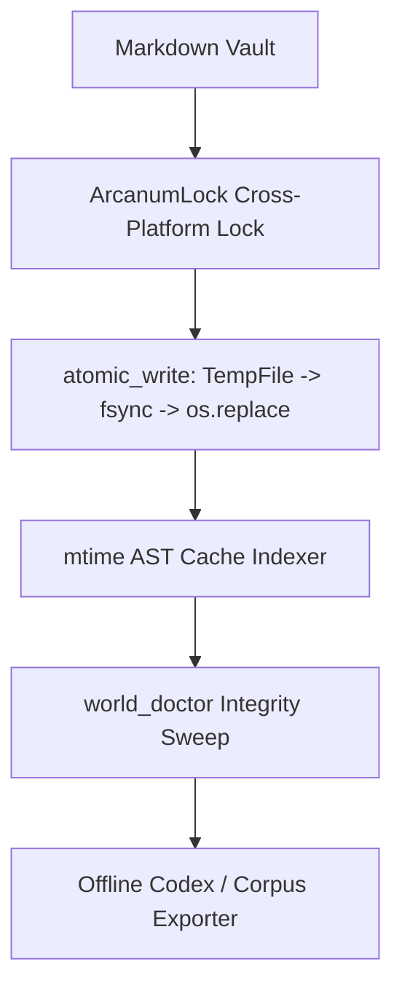

# System Engineering, Diagnostics & Vault Operations Guide

> [!NOTE] ⚠️ EDUCATIONAL TEMPLATE (AI-GENERATED)
> **Notice**: This template was AI-generated for educational demonstration and craft guidance within the Ars Arcanum operating system. It is strictly non-commercial and provided solely to demonstrate system features, mechanical schemas, and engine capabilities. Authors should replace placeholder values with their original vault configuration details.

<details>
<summary>💡 <b>Ars Arcanum Engine Guidance & Feature Breakdown (Click to Expand)</b></summary>

### Features Demonstrated in This Operational Guide:
- **Dangling Wikilink Sweeper**: `world_doctor` (`arcanum doctor World-Bible/`) — Finds broken links to nonexistent lore files across the vault.
- **Fuzzy Name Variant Finder**: `world_doctor` (`arcanum doctor World-Bible/ --fuzzy`) — Detects accidental character and location spelling variants (e.g. *Althea* vs *Althaea*).
- **Timeline Chronology Checker**: `world_doctor` (`arcanum doctor World-Bible/ --timeline`) — Enforces chronological ordering and birth/death date invariants.
- **Toolchain Probe & Air-Gap Network Isolation Audit**: `diagnostics` (`arcanum doctor`, `arcanum doctor --audit-airgap`, `arcanum doctor --bundle`) — Verifies toolchain availability (Typst, Pandoc, Git, Python 3.10+) and guarantees zero network telemetry.
- **Cache Invalidation & Sweeper & mtime AST Indexer**: `cache` (`arcanum cache warm`, `arcanum cache clear`) — Maintains an in-memory mtime-keyed Abstract Syntax Tree index for instantaneous vault traversal.
- **Atomic Write Engine & Cross-Platform File Lock (ArcanumLock)**: `fs_utils` (`atomic_write()`, `ArcanumLock()`) — Eliminates race conditions and partial write corruption during background operations.
- **Vault Schema Upgrader & Pre-Migration Safety Snapshot**: `migrate` (`arcanum migrate World-Bible/ --snapshot`) — Safely upgrades legacy vault schemas with automated compressed safety snapshots.
- **Hybrid RRF Query Engine & Context Pack Builder**: `local_rag` (`arcanum rag "lunar eclipse"`) — Indexes lore into offline TF-IDF and SQLite FTS5 databases with Zero-Network Embedding Database storage.
- **JSONL Dataset Exporter & Bidirectional Vault Restore**: `corpus_export` (`arcanum corpus export`, `arcanum corpus restore`) — Exports structured JSONL datasets and SQLite databases for sovereign archival and lossless restore.
- **Single-File HTML Wiki Exporter & Interactive Spoiler Slider**: `codex_export` (`arcanum codex World-Bible/ --html dist/codex.html --spoiler-protection`) — Builds a standalone HTML knowledge base with interactive spoiler sliders.
- **Configuration Getter/Setter & Cascading Resolution Inspector**: `config` (`arcanum config set target_words 95000`, `arcanum config trace target_words`) — Inspects and modifies project preferences.
- **Dynamic Intelligent Tips Subfeatures**: `tips` (`arcanum tip`) — Includes **Contextual Relevance Filter**, **Non-Obvious Masterclass Database**, **Zero-Stall History Cycling**, **Sovereign Display Configuration**, and **Cross-Platform Ambient Presentation**.
- **Metadata Menu Integration**: Validated against `Templates/fileClasses/SystemEngineeringOps.md`.

### How to Use for Your Projects:
1. Run `arcanum doctor` regularly to keep your wikilink network clean and free of dead references.
2. Use `arcanum resonance cascade` before making major cosmology or timeline changes to preview downstream narrative consequences.
3. Export standalone codex archives via `arcanum codex` for portable, offline lore consultation on mobile devices or e-readers.
</details>

---

## 🛡️ 1. Sovereign Invariants & Defense in Depth



---

## 🔍 2. Core Operational Command Matrix

| Administrative Task | CLI Command | Underlying Engine | Key Verification Benefit |
| :--- | :--- | :--- | :--- |
| **Lore Integrity Check** | `arcanum doctor World-Bible/` | `world_doctor` | Zero broken links or orphan notes. |
| **Fuzzy Name Search** | `arcanum doctor World-Bible/ --fuzzy`| `world_doctor` | Catches typos like *Althea* vs *Althaea*. |
| **Air-Gap Verification**| `arcanum doctor --audit-airgap` | `diagnostics` | Proves 100% offline isolation. |
| **Warm Performance Cache**| `arcanum cache warm` | `cache` | Instantaneous CLI response times. |
| **Safe Schema Migration**| `arcanum migrate World-Bible/ --snapshot`| `migrate` | Upgrades tags with automated rollback archive. |
| **Offline Semantic Query**| `arcanum rag "lunar eclipse"` | `local_rag` | Retrieves relevant lore snippets via SQLite FTS5. |
| **Interactive Wiki Codex**| `arcanum codex World-Bible/ --html`| `codex_export` | Single-file searchable offline HTML encyclopedia. |
| **Causal Cascade Simulation**| `arcanum resonance cascade astro --param axial_tilt --val 38.5` | `resonance` | Simulates climate, calendar, and cultural fallout. |
| **Dynamic Tip Cycling** | `arcanum tip --cycle` | `tips` | Ambient non-repeating masterclass craft advice. |

---

## 📊 3. Cascading Configuration Hierarchy

Ars Arcanum resolves settings across four hierarchical layers:

```
[1. Built-in Factory Defaults]
       │
[2. Global User Config (~/.config/ars-arcanum/config.json)]
       │
[3. Project Local Config (.arcanum.json / world.yaml)]
       │
[4. CLI Runtime Flags (--target 100000, --paper cream-55)]
```

Inspect the exact cascading resolution for any setting:
```bash
arcanum config trace target_words
```
